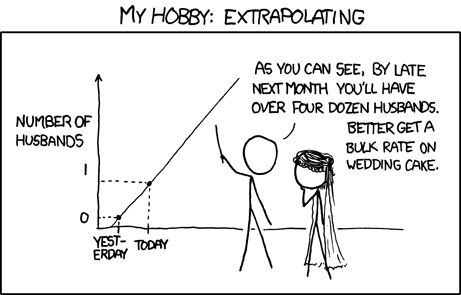
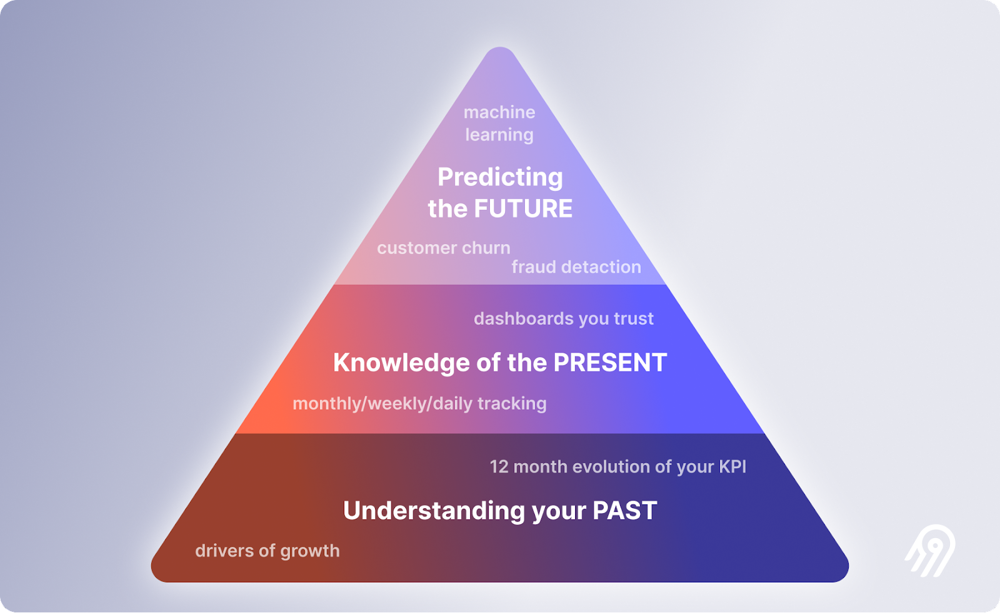

Esta es la segunda parte de una serie de posts explicando la ciencia de datos en lenguaje para personas que no saben nada al respecto. [Puedes ver todos los posts de la serie aquí](/tags/demystifying-data-science/).

_Más sabe el diablo por viejo que por diablo. - Proverbio Colombiano_

# **Los datos son la base de todas las buenas decisiones.**
---

Un _dato_ es un hecho medible y comunicable: un tiempo, lugar, nombre, número. Un dato es una "pieza" o unidad de información. El hecho de que mi esposa llegó a casa hoy a las 5:54 PM es un _dato_. Cuando hablamos de _información_, en realidad estamos hablando del plural o un conjunto de datos.

Un _insight_ es un aprendizaje obtenido de la unión de varios, idealmente muchos, datos. Estos pueden ser agregados de forma simple o transformados usando cualquier variedad de técnicas para llegar al _insight_. Según el diccionario Oxford, se define como "una comprensión profunda y precisa", enfatizando que el insight es el entendimiento en sí como sustantivo. Por ejemplo, si sé que mi esposa llega a casa todos los días alrededor de las 6 PM, esa es una comprensión profunda sobre mi esposa, o un _insight_.

No todos los insights son igualmente valiosos. Si los datos de los que están compuestos son erróneos por cualquier razón, el insight será erróneo también. También tienden a tener fechas de vencimiento: lo que aprendí hace 20 años puede no ser válido hoy. Y la cantidad de datos también es relevante: un insight construido con dos datos no es tan robusto como uno compuesto de cientos, miles o millones.

 _Fuente: XKCD_

Hay insights que son muy resistentes al tiempo y mantienen su calidad. Los refranes, por ejemplo, son insights creados a partir de datos recopilados a través de la experiencia cotidiana de una cultura entera a lo largo de generaciones y convertidos en una enseñanza fácil de entender y aprender: "camarón que se duerme se lo lleva la corriente", "más sabe el diablo por viejo que por diablo". Estos refranes alimentan el conocimiento de la vida diaria de toda una cultura.

Otros, como la serie de desayunos que he tenido en el último mes, son más etéreos. Hoy, ni siquiera recuerdo qué desayuné anteayer, y no es raro que olvide que desayuné cuando llega la noche. El insight sobre el número promedio de calorías que consumo en el desayuno comparado con el de mi esposa sería interesante de saber, pero rápidamente olvidado como un dato curioso, ya que ni cuento calorías ni mi esposa hace comparaciones de ese tipo.

En general, se sigue un proceso simple para crear insights: Primero, debemos hacer una _pregunta_. Luego, entendemos la calidad de los datos mismos y corregimos sus deficiencias. Finalmente, buscamos crear insights que nos ayuden a responder nuestra pregunta a través de modelos simples o sofisticados. Algunos modelos simples son líneas de tiempo o regresiones, y algunos de los sofisticados son Árboles de Decisión o las famosas Redes Neuronales. Nuestra pregunta determinará la complejidad de nuestros modelos:

¿Qué pasó? Simple.
¿Por qué pasó? No tan fácil.
¿Qué pasará? Difícil.
¿Qué es lo mejor que puede pasar? Más complejo.

 _Fuente: Airbyte_
