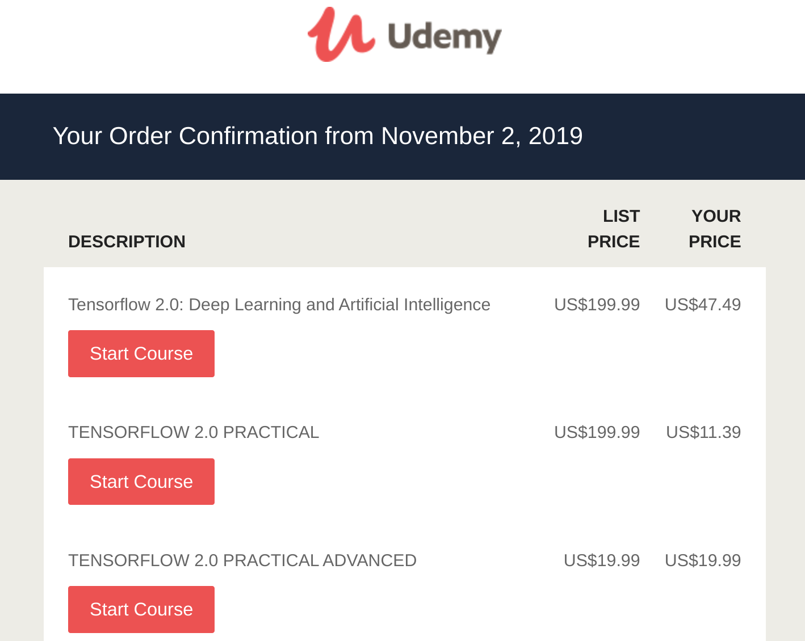
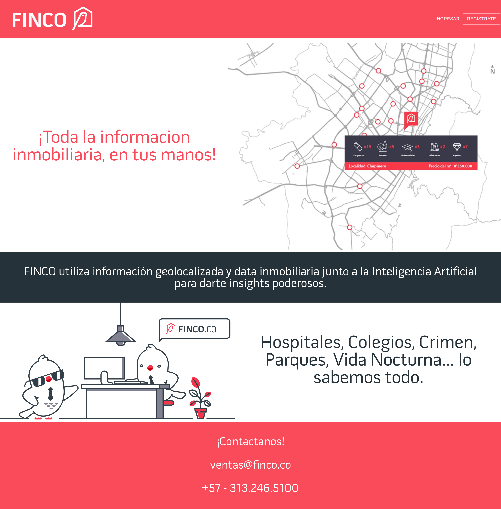
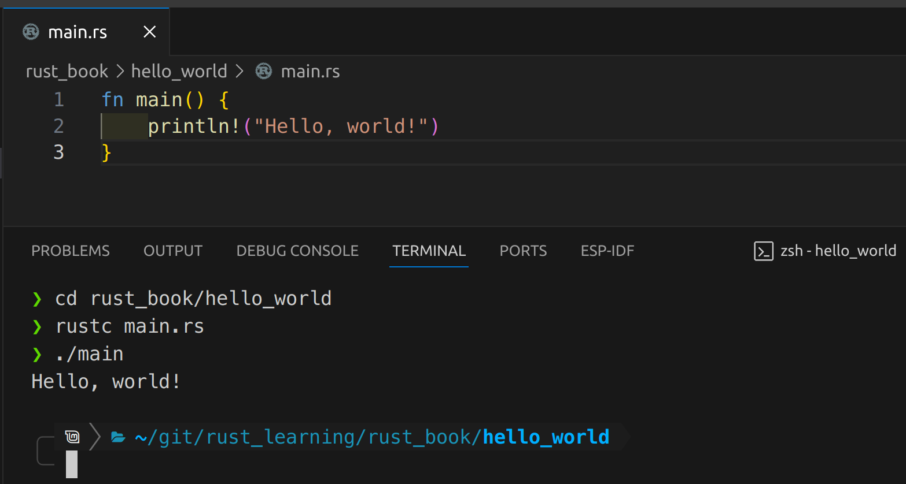

import { Image } from 'astro:assets';
import PythonStart from './python_start.jpg';
import FirstModel from './first_model.png';

## Metiendo los pies al agua

Empecé ciencias de la computación en la Universidad y tuve exposición limitada a Java antes de cambiarme a Economía porque pensé que sería fácil y que tendría más tiempo para jugar videojuegos (no era el adolescente más trabajador).

Después de finalmente graduarme, estaba adicto a League of Legends y aprendí Python básico para hacer scraping de datos de un sitio como [OP.GG](https://www.op.gg/) (pero estoy bastante seguro de que era un sitio diferente) para poder meterme en peleas sin sentido en Reddit sobre qué build de Vayne te daba el mayor DPS, conocimiento que procedí a desperdiciar en mi residencia vitalicia en Bronce y Plata.

En 2014 conseguí mi primer trabajo donde la programación sería útil. Era Analista de Datos en British American Tobacco, donde tenía que analizar datos de Nielsen que llegaban mensualmente y construir un montón de reportes, tanto archivos de Excel complejos donde tenía que copiar-pegar datos hoja por hoja y seguir peleando con macros y fórmulas de múltiples archivos, como presentaciones de PowerPoint que siempre tenían las mismas diapositivas, solo cambiando las gráficas. Tomaba 1 semana cada mes terminarlo. La Automatización de Datos era PERFECTA para este rol. Le pregunté a mi jefa si podía usar Python para automatizar el proceso. Dijo que no, <ins>__no tenemos tiempo para que aprendas eso__</ins>.

Dato curioso: Me quedé completamente calvo durante este trabajo. Tenía 23 años.

Así que volví al infierno del copiar-pegar. Rápidamente olvidé la programación por un rato.

## La motivación

Después de un par de años, empecé mi primera empresa de tecnología. No estaba programando mucho, pero pude hablar mucho con [Luis](https://www.linkedin.com/in/luis-eduardo-patt-23463034/), a quien le estaba tercerizando todo el desarrollo tecnológico real. Él me enseñó lo suficiente para que me interesara MUCHO intentar aprender por mi cuenta. Trabajamos juntos principalmente en PrestaGente.

Cuando me cambié a Beriblock, mis principales inversionistas en Estados Unidos exigieron que contratáramos un equipo de desarrollo en Ucrania. Ahí aprendí el verdadero costo de tercerizar el core de tu empresa. Todo lo que necesitábamos pasaba lento, era caro, y yo no tenía poder para hacerlo yo mismo. ¡Nunca más! Si alguna vez iba a ser emprendedor tech de nuevo, tendría control sobre el desarrollo de software.

## La inmersión 👨‍💻 - Python

Entonces, finalmente empecé Finco con [Oscar AKA "El Abuelo"](https://www.linkedin.com/in/oscarcorredor/), no teníamos plata para tercerizar y él no tenía idea de cómo construir modelos de Machine Learning. Yo tampoco 🙈. Tenía experiencia en análisis de datos tanto por mi trabajo en multinacionales como en mis startups, ¡pero no había programado una línea real en años! Pero como él ya había construido el scrapper de datos y ahora necesitaba construir la primera versión de nuestro reporte (el producto principal), me tocó a mí aprender Python, Pandas, Estadística, Machine Learning y Tensorflow. Ah, y también necesitábamos tener la primera versión "buena" del modelo en menos de 2 meses.

Como teníamos poco tiempo, decidí simplemente seguir los cursos de Tensorflow y aprender el resto sobre la marcha. ¿Qué tan difícil podía ser? Además, [estaba leyendo esto al lado](https://github.com/janishar/mit-deep-learning-book-pdf).

*Empecé con los cursos fáciles*

El inicio no fue genial. Tenía problemas con la gestión de entornos, no podía hacer que Tensorflow corriera en mi GPU, y nunca había programado nada de complejidad alguna en mi vida. Pero simplemente me devoré el libro de Deep Learning y seguí estrellándome de frente contra el modelo con grados variables de fracaso.

Hasta que finalmente, lo hice funcionar. Era malo, pero funcionaba.

  <Image src={PythonStart} alt="alt text" class="!max-w-full" />
  
 ...20 días y noches después... 

  <Image src={FirstModel} alt="alt text" class="!max-w-full" />

## Los plazos te hacen aprender rápido

Seguí mejorando el modelo y aprendiendo Python en general. Eventualmente, entré al programa [Data Science for All](https://www.correlation-one.com/blog/ds4a-colombia-mintic-cohort-6), donde perfeccioné y profesionalicé muchas de las habilidades que había aprendido desordenadamente. También hice una red de contactos increíble y me posicioné como un "Científico de Datos". Y podía decir orgullosamente que "sabía Python 🐍", lo que sea que eso signifique.

Oscar había estado trabajando duro en el primer reporte (ahora usando mi modelo y un montón de análisis automatizados que construimos como insumo), pero no teníamos sitio web. Ni landing page. Esto estaba bien por el momento, no habíamos planeado lanzar en unos meses. Además, Oscar odia hacer cosas de Frontend.

La pandemia estaba arrasando (el país cerró un día antes) y de repente llegó la noticia de que el gobierno convocó una cumbre de alcaldes, donde empresas tech podían mostrar cómo podían ayudar. Y yo pensé que podíamos ayudar con análisis geoespacial. ¡Pero no teníamos landing page!

Esto fue a las 12:50 PM. La cumbre era a las 6 AM del día siguiente. Sabía que era ahora o nunca: si quería contribuir en el lado backend además de Machine Learning (estábamos en Node.js) o al Frontend, tenía que aprender Typescript. Oscar se iba a enfocar en tener el reporte listo, y yo tenía que aprender FrontEnd rápido.

Este fue el resultado a las 5 AM del día siguiente. Mi primer sitio web (no tenía idea de lo que estaba haciendo).

*Esto probablemente fue visto por un gran total de 0 alcaldes*

Esa pequeña y fea landing page fue un fracaso como generador de ventas, pero me hizo aprender lo básico de HTML, CSS, Typescript y React. Ahora podía llamarme novato en Frontend, pero no un completo ignorante.

En los siguientes ~5 años continuaría aprendiendo más sobre Python y Typescript en paralelo. Contribuí enormemente a todas las partes de nuestro stack, conseguí algunos trabajos de consultoría y eventualmente me uní a R5, donde mejoré mis habilidades aún más, particularmente en Arquitectura y Diseño de Software. En general, hoy soy aceptable en Typescript (tanto Frontend como Backend), bueno en Python para backend y me atrevo a decir que soy un Científico de Datos bastante bueno. También he tenido la oportunidad de aprender sobre DevOps un poco, en particular gracias a [Jesús](https://www.linkedin.com/in/jesusreyesve/) y [Juan](https://www.linkedin.com/in/juan-moya-0775691a8/).

## Rust 🦀

Durante los últimos 2 años, seguí pensando que sería genial aprender un nuevo lenguaje de programación que fuera muy performante y que me revolviera un poco el cerebro. Pasar de Python a Typescript no fue tan difícil, la mayoría de los conceptos eran fácilmente transferibles. Necesitaba algo _diferente_.

Estuve indeciso un rato entre Golang y Rust. Hackernews sigue inflando Rust como si fuera lo mejor desde la invención de TCP/IP, pero Go parecía más fácil de aprender en general. Decidí aprender Go por mi tiempo limitado mientras trabajaba en R5 y criaba gemelos, pero apenas empecé antes de abandonarlo por falta de tiempo.

Ahora que salí de R5, el problema del tiempo parece haber desaparecido. Así que, con las nuevas circunstancias, decidí aprender Rust. Hoy es mi primer día, [el libro está listo](https://doc.rust-lang.org/book/) y mi mente está decidida. ¡Deséenme suerte!

### Recursos de aprendizaje

En el camino intenté retroceder y llenar los vacíos del conocimiento que me salté al ignorar todos los básicos mientras corría hacia un producto funcional. Me gusta mucho [Roadmap.sh](https://roadmap.sh/). Creo que todos deberían ir a revisar cualquier camino en el que estén (¡incluso si ya tienen bastante experiencia!) y ver si hay algo que tal vez se les haya pasado u olvidado en el camino.

Además de eso, [mantengo una lista de recursos que he encontrado útiles en el camino](/resources). ¡Espero que sea de utilidad!

### ...1 hora después, editado...

*¡Mis primeras líneas de Rust!*
