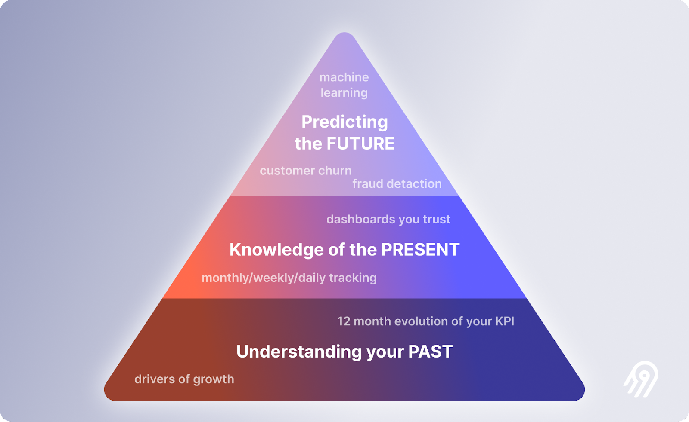

This is the second part of a series of posts explaining data science in language for people who don't know anything about it. [You can see all the posts in the series here](/tags/demystifying-data-science/).

_The devil is wiser from age than from being the devil. - Colombian Proverb_

# **Data is the foundation of all good decisions.**
---

A _data point_ is a measurable and communicable fact: a time, place, name, number. Data is a "piece" or unit of information. The fact that my wife arrived home today at 5:54 PM is a _data point_. When we talk about _information_, we're actually talking about the plural or a set of data points.

An _insight_ is learning obtained from the union of several, ideally many, data points. These can be aggregated simply or transformed using any variety of techniques to reach the _insight_. According to the Oxford dictionary, it's defined as "a deep and accurate understanding," emphasizing that insight is the understanding itself as a noun. For example, if I know my wife arrives home every day around 6 PM, that's a deep *understanding* about my wife, or an _insight_.

Not all insights are equally valuable. If the data they're composed of is erroneous for any reason, the insight will be erroneous too. They also tend to have expiration dates: what I learned 20 years ago might not be valid today. And the amount of data is also relevant: an insight built with two data points isn't as robust as one composed of hundreds, thousands, or millions.

 _Source: XKCD_

There are insights that are very resistant to time and maintain their quality. Proverbs, for example, are insights created from data collected through the everyday life experience of an entire culture over generations and turned into a teaching that is easy to understand and learn: "a shrimp that falls asleep is carried away by the current," "the devil knows more because he is old than because he is the devil." These proverbs feed the knowledge of daily life for an entire culture.

Others, like the series of breakfasts I’ve had in the last month, are more ethereal. Today, I don’t even remember what I had for breakfast the day before yesterday, and it’s not uncommon for me to forget that I’ve had breakfast by the time night comes. The insight into the average number of calories I consume for breakfast compared to my wife’s would be interesting to know, but quickly forgotten as a fun fact, since I neither count calories nor does my wife make comparisons of that kind.

In general, a simple process is followed to create insights: First, we must ask a _question_. Then, we understand the quality of the data itself and correct its deficiencies. Finally, we aim to create insights that help us answer our question through simple or sophisticated models. Some simple models are timelines or regressions, and some of the sophisticated ones are Decision Trees or the famous Neural Networks. Our question will determine the complexity of our models:

What happened? Simple.  
Why did it happen? Not so easy.  
What will happen? Difficult.  
What is the best that can happen? More complex.

 _Source: Airbyte_
