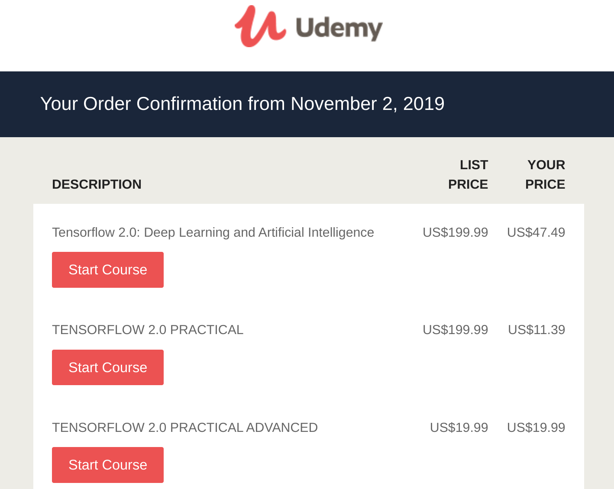
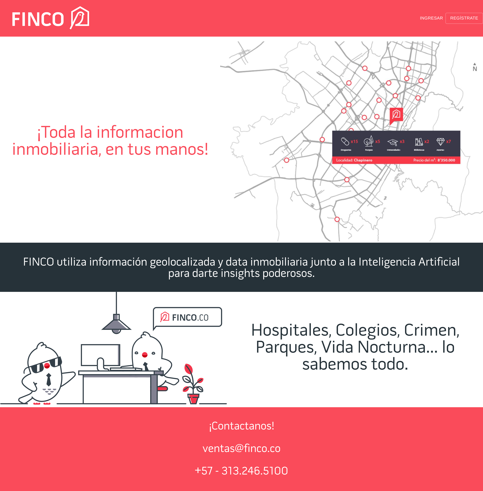
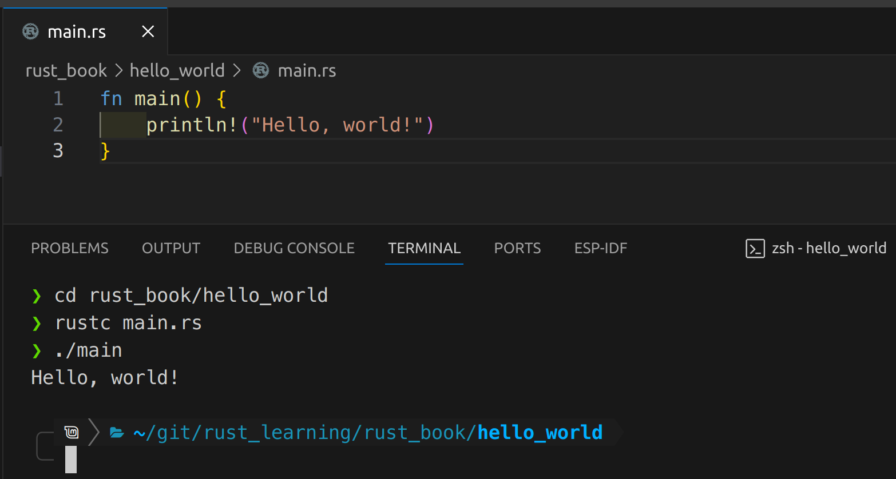

import { Image } from 'astro:assets';
import PythonStart from './python_start.jpg';
import FirstModel from './first_model.png';

## Dipping my toes in

I started computer science at University and had limited exposure to Java before switching to Economics since I thought it would be easy and that I'd have more time to play video games (I wasn't the most hard-working teenager). 

After finally graduating, I was addicted to League of Legends and learned basic Python to scrape data out of a site like [OP.GG](https://www.op.gg/) (but I'm pretty sure it was a different site) so I could get into senseless fights on Reddit on what build for Vayne gave you the highest DPS, knowledge I proceeded to squander on my lifetime tenure in Bronze and Silver.

In 2014 I landed my first job where programming would come in handy. I was a Data Analyst at British American Tobacco, where I had to analyze Nielsen data that came in monthly and build a fuckton of reports, both complex Excel files where I had to copy-paste data sheet by sheet and keep messing with multi-file macros and formulas, and PowerPoint presentations that always had the same slides, just changing the graphs. It took 1 week each month to get it done. Data Automation was PERFECT for this role. I asked my manager if I could use Python to automate the process. She said no, <ins>__we don't have any time for you to learn that__</ins>. 

Fun fact: I went completely bald during this job. I was 23 years old.

So back I went into copy-paste hell. I promptly forgot about programming for a while.

## The motivation

After a couple of years, I started my first tech company. I wasn't coding much, but I got to talk a lot with [Luis](https://www.linkedin.com/in/luis-eduardo-patt-23463034/), who I was outsourcing all the actual tech-development to. He taught me enough to make me REALLY interested in attempting to learn for myself. We worked together in PrestaGente mainly.

When I switched to Beriblock, my main investors in the US demanded we hire a development team in Ukraine. Then I learn the true cost of outsourcing the core of your company. Everything we needed happened slowly, was expensive, and I had no power to make it myself. Never again! If I was ever going to be a tech entrepreneur again, I would have control over software development.

## The dive 👨‍💻 - Python

Then, I finally started Finco with [Oscar AKA "El Abuelo"](https://www.linkedin.com/in/oscarcorredor/), we had no money for outsourcing and he had no idea how to build Machine Learning Models. Neither did I 🙈. I had experience in data analytics for both my work in multinationals and my startups, but hadn't coded an actual line in years! But since he had already built the data scrapper and now needed to build the first version of our report (the main product), it landed on me to learn Python, Pandas, Statistics, Machine Learning, and Tensorflow. Oh, and we also needed to get the first "good" version of the model in less than 2 months.

Since we had little time, I decided I would just follow the Tensorflow courses and learn the rest on the go. How hard could it be? Also, [I was reading this on the side](https://github.com/janishar/mit-deep-learning-book-pdf).

*I started with the easy courses*

The start wasn't great. I was having issues with environment management, I couldn't get Tensorflow to run on my GPU, and I had never coded anything of any complexity ever in my life. But I simply crammed the Deep Learning Book and kept crashing head-first into the model with varying degrees of failure.

Until finally, I got it working. It sucked, but it worked.

  <Image src={PythonStart} alt="alt text" class="!max-w-full" />
  
 ...20 days and nights later... 

  <Image src={FirstModel} alt="alt text" class="!max-w-full" />

## Deadlines make you learn fast

I kept on improving the model and learning Python in general. Eventually, I got into [Data Science for All](https://www.correlation-one.com/blog/ds4a-colombia-mintic-cohort-6) program, where I honed and professionalized many of the skills I had learned haphazardly. I also made an amazing network and positioned myself as a "Data Scientist". And I could proudly say I "knew Python 🐍", whatever that means.

Oscar had been hard at work in the first report (now using my model and a ton of automated analysis that we built as input), but we had no website. No landing page at all. This was OK for the time being, we hadn't planned on launching for a few months. Also, Oscar hates doing Frontend stuff.

The pandemic was raging (the country was closed one day before) and suddenly news came that the government called for an all-mayors-summit, where tech companies could show off how they could help. And I thought we could help with geospatial analysis. But we had no landing page!

This was at 12:50 PM. The summit was at 6 AM the next day. I knew it was now or never: If I wanted to contribute on the backend side besides Machine Learning (we were on Node.js) or to the Frontend, I had to learn Typescript. Oscar was going to focus on having the report ready, and I had to learn FrontEnd fast.

This was the result at 5 AM the next day. My very first website (I had no idea what I was doing).

*This was probably seen by a grand total of 0 mayors*

That little ugly landing page was a failure as a sales generator, but it got me to learn the bare basics of HTML, CSS, Typescript, and React. I could now call myself a noob at Frontend, but not a complete ignorant.

Over the following ~5 years I would continue to learn more about both Python and Typescript in parallel. I contributed greatly to all parts of our stack, landed some consulting gigs and eventually joined R5, where I improved my skills further, particularly on Software Architecture and Design. Overall, today I am ok at Typescript (both Frontend and Backend), good at Python for backend and I dare say a pretty good Data Scientist. I've also had the opportunity to learn about DevOps a little bit, in particular thanks to [Jesús](https://www.linkedin.com/in/jesusreyesve/) and [Juan](https://www.linkedin.com/in/juan-moya-0775691a8/).

## Rust 🦀

During the last 2 years, I kept thinking it would be great to learn a new programming language that was very perfomant and that rattled my brain a bit. Going from Python to Typescript wasn't so bad, most of the concepts were transferable easily. I needed something _different_.

I was stuck for a while between Golang and Rust. Hackernews keeps pumping Rust up as if it was the best thing since the invention of TCP/IP, but Go seemed easier to learn overall. I decided to learn to Go because of my limited time while working at R5 and raising twins but barely started before abandoning it because of a lack of time.

Now that I'm out of R5, the time issue seems gone. So, with the new circumstances, I decided to learn Rust. Today is my first day, [the book is ready](https://doc.rust-lang.org/book/) and my mind is set. Wish me luck!

### Learning Resources

On the way I tried to backtrack and fill in the gaps of the knowledge I skipped from ignoring all the basics while rushing to a working product. I'm very fond of [Roadmap.sh](https://roadmap.sh/). I think everyone should go check whatever path they are on (even if you are already quite experienced!) and see if there is anything maybe you have missed or forgotten on the way.

Besides that, [I keep a list of resources I've found useful on the way](/resources). I hope it's of use!

### ...1 hour later edit...

*My first lines of Rust!*