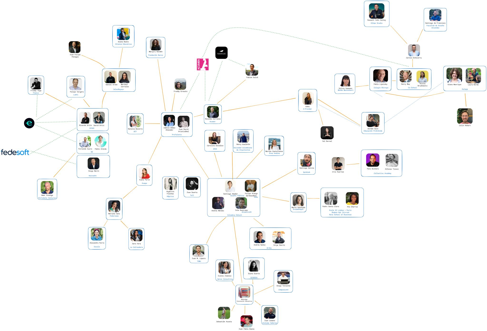

> *Originally posted on [LinkedIn](https://www.linkedin.com/posts/smuriel_jam%C3%A1s-hab%C3%ADa-trabajado-en-educaci%C3%B3n-o-impacto-activity-7296276443825688576-viQy)*

I had never worked in education or social impact in my life. How do you break into an ecosystem you're completely ignorant about? How do you rethink higher education without any context?

"Easy": Let the best people teach you 🚀

For the past 3 months I've been talking to anyone in the education and impact world who'll listen — to learn about the real problems from those who've been living them for years. I've had conversations with educators, founders and directors of schools and universities, entrepreneurs, consultants, education enthusiasts, impact investors, and more.

My entry points were [David Ortiz](https://linkedin.com/in/david-ortiz-9b64a8b) and [Santiago Amador](https://linkedin.com/in/santiago-amador-91b1733b), and from there each conversation brought 2 or 3 more contacts. Both of them have been indispensable on this journey — thank you!

What's been so cool is that everyone in this world opens doors for you. Everyone is willing to lend a hand, even if just with an opinion. I'm genuinely grateful to each person for their generosity ❤️

I put together a little map (not sure how well it comes through on LinkedIn!) of the ~60 people I've talked with so far. Any suggestions for who else I should be talking to? If you know someone in the world of education innovation, higher education, or impact entrepreneurship, I'd love to meet them!

