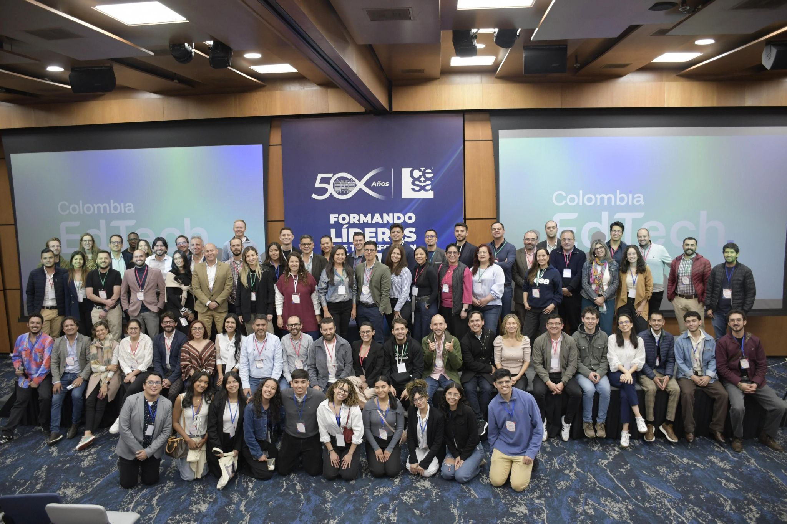

> *Originally posted on [LinkedIn](https://www.linkedin.com/posts/smuriel_hace-una-semana-andr%C3%A9s-m%C3%A9ndez-me-invit%C3%B3-a-activity-7313941508611592192-y-IK)*

A week ago [Andrés Méndez](https://linkedin.com/in/andresfmendez) invited me to the first Colombia EdTech Assembly. So exciting to meet more people passionate about the intersection of education and technology, and to reconnect with some of the field leaders who've helped me over these past 4 months: [Henry May](https://linkedin.com/in/henry-may), [Felipe Arango Gardeazábal](https://linkedin.com/in/felipearango9), [Jole Restrepo](https://linkedin.com/in/jolerestrepo-edtech-apropiacion).

Hopefully next year I'll be less of a crasher (I don't even have a company yet 😅) and attending as an official member!

Thanks Andrew for the invitation. Awesome stuff.

