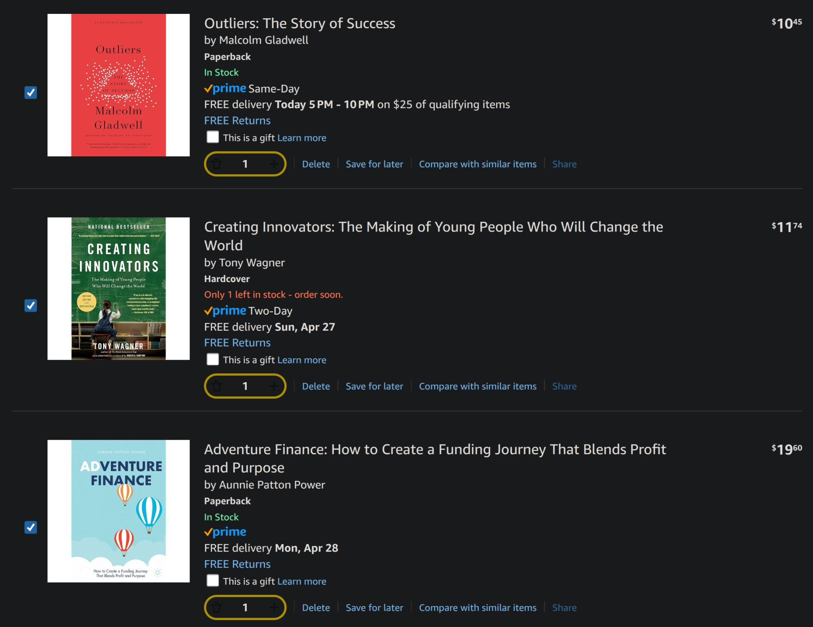

> *Originally posted on [LinkedIn](https://www.linkedin.com/posts/smuriel_bache-de-libros-para-ganar-m%C3%A1s-perspectiva-activity-7321563728557060096-taUd)*

📚 A batch of books to gain more perspective for our high social impact education project 🤔

1. We're aiming to redefine the methodologies needed to develop professionals who are doers/creators/inventors that change the status quo. [Diana Paola Basto Castro](https://linkedin.com/in/dianabasto) recommended "Creating Innovators: The Making of Young People Who Will Change the World." Couldn't be more perfect 🔥

2. We want to find young people who dare to be different, think outside the box, take the road less traveled. [Marcela Salinas Murillo](https://linkedin.com/in/marcelasalinasm) recommends "Outliers: The Story of Success." Dozens of examples of people who managed to break the mold.

3. Learning about the impact investing world has been a real challenge. Unlike the VC path, there are no well-defined rules, standard terms, or many models to follow. Wild West 🤠. [Roberto Navas](https://linkedin.com/in/roberto-navas-59600b2) shared his "bible" — "Adventure Finance: How to Create a Funding Journey That Blends Profit and Purpose." Real stories of creative financing in LatAm social enterprises.

4. One of the world's most successful cases of transforming education is [KAOSPILOT](https://www.linkedin.com/school/kaospilot/). "Kaospilot A-Z" lays out the model from start to finish, straight from the founder's mouth. [Camilo Bonilla](https://linkedin.com/in/camilobonilla), passionate about innovative education, says "it's one of the books that has most inspired me in my life." It's no longer sold new, so it's not in the photo... but you can find it through other means!

I hope this list is useful to anyone else dreaming their way into education or social impact. Any other recommendations?

