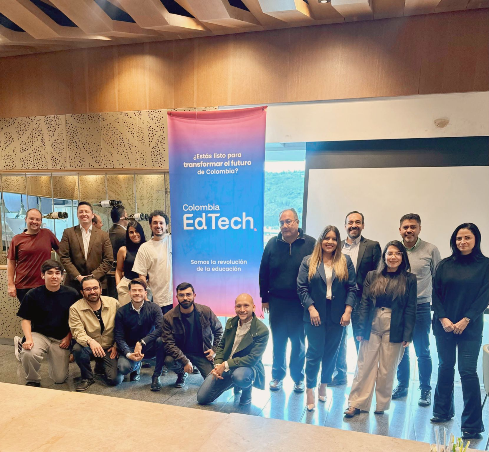

> *Originally posted on [LinkedIn](https://www.linkedin.com/posts/smuriel_el-martes-estuve-en-la-universidad-de-la-activity-7333878663194533888-vM_-)*

On Tuesday I was at [Universidad de La Sabana](https://www.linkedin.com/school/universidad-de-la-sabana/) for my first official session as a member of [Colombia EdTech](https://www.linkedin.com/company/edtechhublatam/) ❤️

We talked synergies, how to put together a solid EdTech "Humble Bundle," what it takes to collaborate with giants like [UNIMINUTO Colombia](https://www.linkedin.com/school/uniminutocol/), and we crushed a MEGA breakfast (standing ovation to the Sabana restaurant — incredible).

What a pleasure to share the morning with [Andrés Méndez](https://linkedin.com/in/andresfmendez), [Felipe Arango](https://linkedin.com/in/felipearango9), [David Triana Agudelo](https://linkedin.com/in/davidtrianaagudelo), [Jaime Eduardo Cáceres](https://linkedin.com/in/jaime-eduardo-cáceres-cáceres-2b366835), [Oskar Fernando Vanegas Garzón](https://linkedin.com/in/oskarfvanegas), [Andrea Ortiz](https://linkedin.com/in/andrea-ortiz-acosta-86346950), [Kevin Ramírez](https://linkedin.com/in/kevin-santiago-ramirez) (and more!). May this be the first of many!

PS: I dropped a teaser there about the name of my new venture and what the first program will look like. The name has something to do with FIRE. Any guesses?

