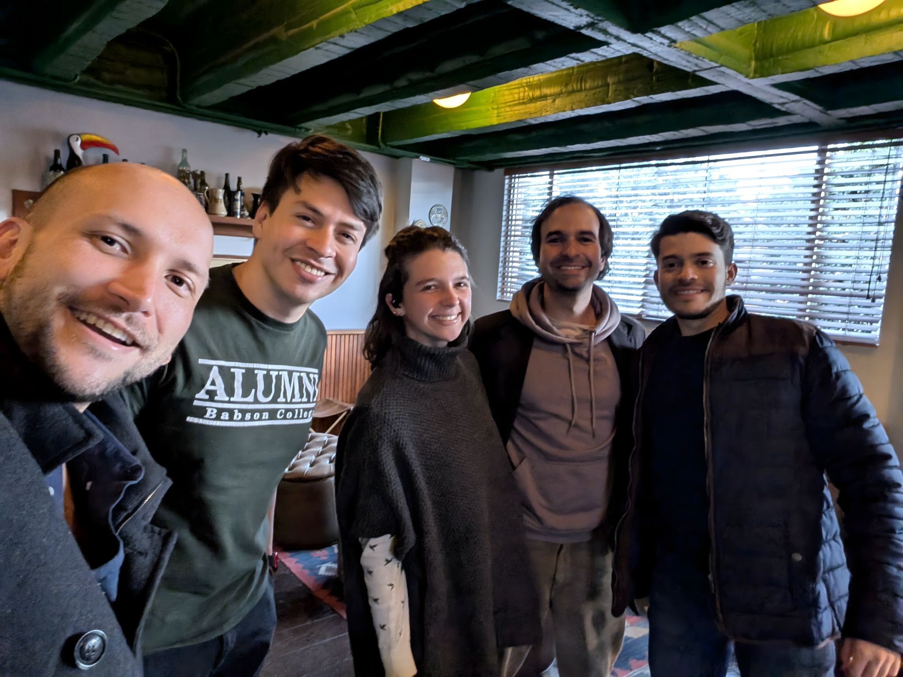

> *Originally posted on [LinkedIn](https://www.linkedin.com/posts/smuriel_hacer-comunidad-es-jodido-y-m%C3%A1s-si-es-presencial-activity-7341878844208898049-XBmj)*

Building community is hard. And harder if it's in person.

Today I was talking with [Sebastian Eljaiek](https://linkedin.com/in/sebastian-eljaiek) about how tech can actually push us apart as people, all in the name of convenience.

We were reflecting on how a major differentiation right now could be going back to the physical — meeting face to face, instead of hyper-digitizing everything 🤖.

That's a big part of why [Ignia](https://www.linkedin.com/company/igniaeducation/) and the Action Lab have a strong in-person component, and why [El Parche Remoto](https://www.linkedin.com/company/parche-remoto/) exists. Live, synchronous, in-person human connection is invaluable.

What do you think? In all this digital noise, is it worth going back to the basics of actually looking each other in the face?

-----------------

On that note, yesterday we had our first Ignition Thursday 🔥 with [David Triana](https://linkedin.com/in/davidtrianaagudelo), [Camilo Eduardo Navarro Herrera](https://linkedin.com/in/camilo-navarro), [Lina Samper Santamaría](https://linkedin.com/in/lina-samper-santamaría-2b6832144), and [Camilo Bonilla](https://linkedin.com/in/camilobonilla). So great to talk about ourselves, the projects in motion, the ones on the horizon, and just connect with like-minded people for a while.

