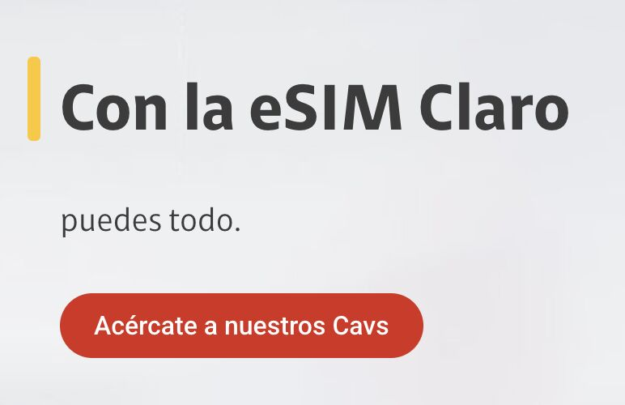

> *Originally posted on [LinkedIn](https://www.linkedin.com/posts/smuriel_para-sacar-una-esim-de-claro-colombia-activity-7344143373840113665-ReAt)*

To get an eSIM from [Claro Colombia](https://www.linkedin.com/company/clarocolombia/)... you have to go to a physical service center 😵‍💫

[ETB](https://www.linkedin.com/company/etb/) - [Diego Molano Vega](https://linkedin.com/in/diegomolanovega) - Low-hanging fruit of innovation and competition. If you're selling a virtual SIM, make it virtual!

