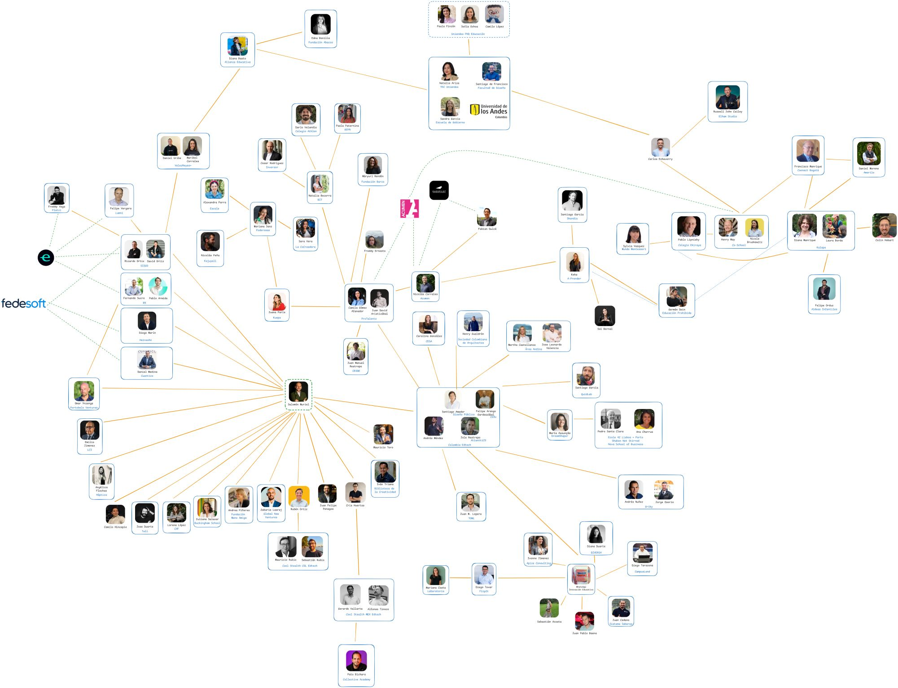
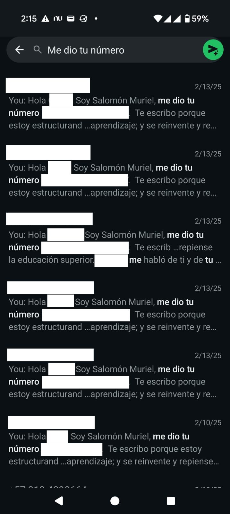
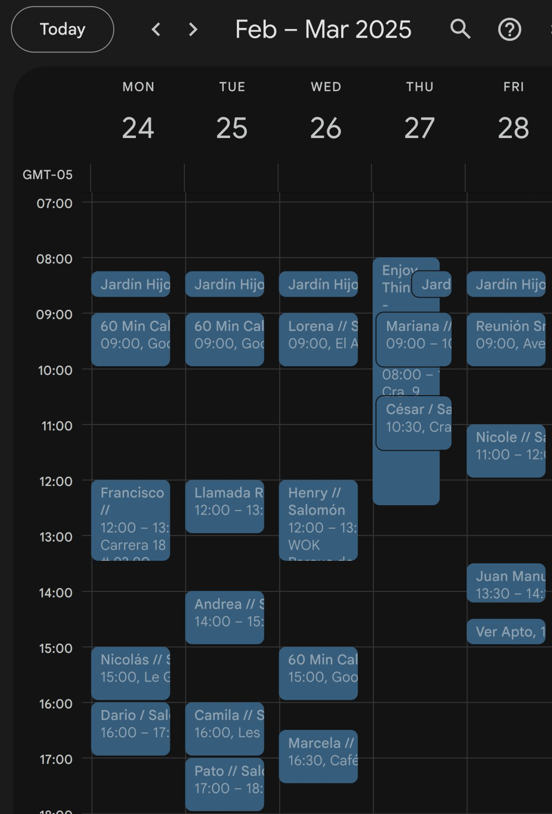

> *Originally posted on [LinkedIn](https://www.linkedin.com/posts/smuriel_habl%C3%A9-con-107-personas-del-mundo-de-la-educaci%C3%B3n-activity-7349519859707224064-5gjj)*

I talked to 107 people in education in 4 months 🎓 Here's exactly how ⬇️

When I left [R5](https://www.linkedin.com/company/grupor5/) to figure out what would eventually become [Ignia](https://www.linkedin.com/company/igniaeducation/), I had no network and no prior experience in this new industry. How do you even research what problems need solving 🤔 ?

Solution: Start with one person, who introduces you to another, who introduces you to another.

[Santiago Amador](https://linkedin.com/in/santiago-amador-91b1733b) was my entry point. He introduced me to [Juan David](https://linkedin.com/in/juandavidaristi) (and 2 others), who gave me [Henry](https://linkedin.com/in/henry-may)'s and [Felipe](https://linkedin.com/in/felipearango9)'s numbers (and 2 others), who gave me [Carlos](https://linkedin.com/in/carlos-echeverry)'s number (and 2 others)...

Every single time, the same approach: a cold WhatsApp message explaining my idea and my intentions: Learn their perspective on Higher Education in Colombia — not selling anything ⛔, just asking for an opinion.

And like that, with 10 to 15 calls, coffees, and lunches per week, in 4 months I had talked to my first 107 education contacts. An inspiring community, full of fire 🔥, always willing to collaborate and open doors.

If you want me to share the meeting structure, the cold WhatsApp message template, and my connection tracking system, just comment "CONNECTION" below 💬

