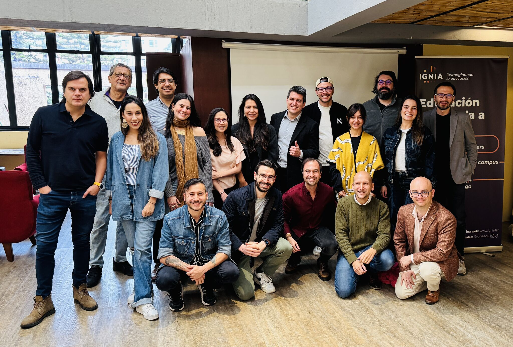

> *Originally posted on [LinkedIn](https://www.linkedin.com/posts/smuriel_en-esta-foto-hay-demasiado-power-junto-literal-activity-7353816217796632576--gTD)*

There is WAY too much power in this photo. I literally teared up from the emotion of seeing these people at the same table.

The [Ignia](https://www.linkedin.com/company/igniaeducation/) Action Lab faculty lineup is out of this world 🔥. Today we had our faculty and partners breakfast, and it was incredible to see the power of bringing brilliant minds together around a shared mission: Reimagining Higher Education.

Infinite thanks to all these amazing people 🧨 who decided to join this mission:
[Santiago Amador](https://linkedin.com/in/santiago-amador-91b1733b), [Sara Samaniego](https://linkedin.com/in/sara-samaniego-06095a43), [Daniela Rojas](https://linkedin.com/in/daniela-rojas-osorio), [Daniel Felipe Pardo Rocha](https://linkedin.com/in/danielfelipepardo), [Angela María Reyes](https://linkedin.com/in/angela-maria-reyes), [Natalia Rodríguez Triana](https://linkedin.com/in/nat-innovacion), [Luis Felipe Barrientos Moreno](https://linkedin.com/in/luis-felipe-barrientos-moreno), [Santiago Cortes Calle](https://linkedin.com/in/santiagocortescalle), [Salua García Fakih](https://linkedin.com/in/saluagarcia), [Jose Duarte](https://linkedin.com/in/joseduarteq), [Laura Sánchez M.](https://linkedin.com/in/laura-sanchez-m), [David Salas](https://linkedin.com/in/davidfsalasm), [Andrés Méndez](https://linkedin.com/in/andresfmendez), [José Manuel Ramírez R.](https://linkedin.com/in/joseramirezr17), [Juan Sebastian H.](https://linkedin.com/in/juanhenaoparra), [Giovanni Stella](https://linkedin.com/in/giovanni-stella), [Camilo Ramirez](https://linkedin.com/in/camilo-ramirez-29975a40), [Daniel Duarte Rico](https://linkedin.com/in/daniel-duarte-rico-1928bb103), [Felipe Arce Lourido](https://linkedin.com/in/felipe-arce-lourido-86259662)

If you want to learn IN PERSON (live and direct!) from this caliber of experts 🔥 to make your ideas real, take your project to the next level, or reinvent yourself professionally — the Action Lab is for you.

We have an in-person info session TODAY and a virtual one next Wednesday. ⏳ Limited spots ⏳. Come hear all about it ▶️ [https://lnkd.in/ebW4FESK](https://lnkd.in/ebW4FESK)

More about the Action Lab: [https://www.ignia.lat](https://www.ignia.lat)

