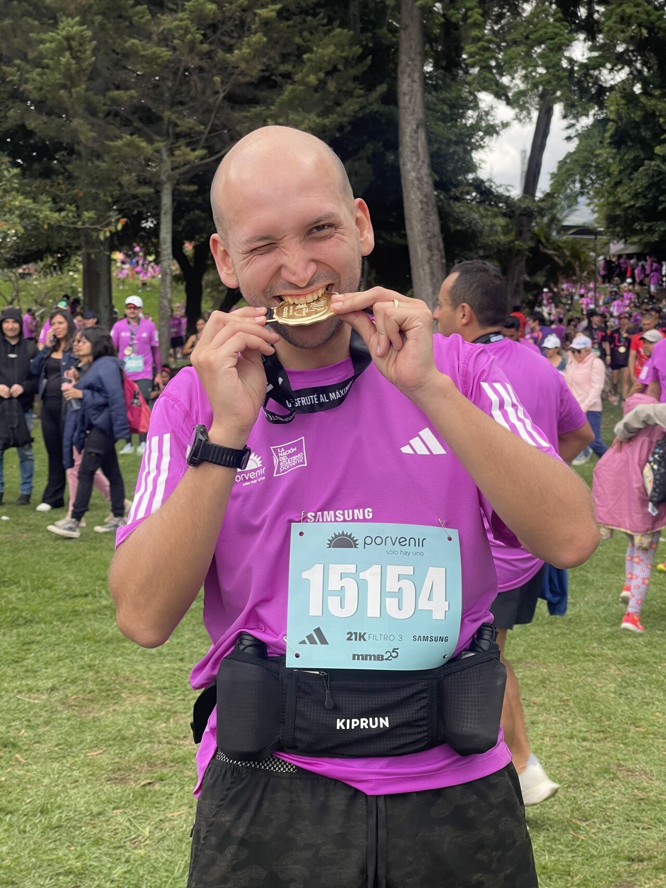
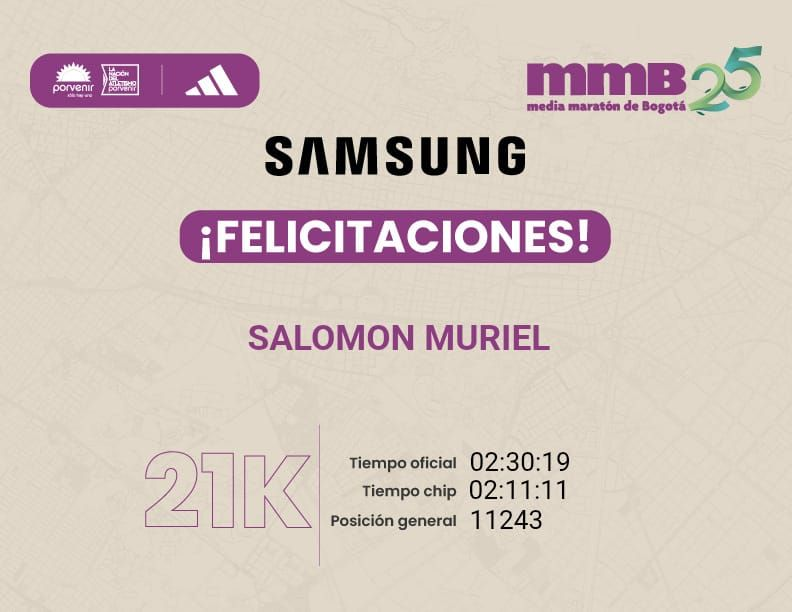
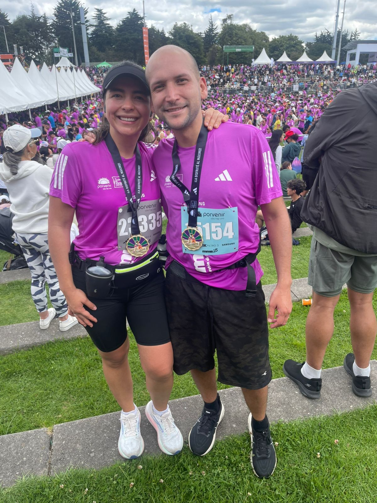

> *Originally posted on [LinkedIn](https://www.linkedin.com/posts/smuriel_pas%C3%A9-de-15-a%C3%B1os-de-cero-ejercicio-a-hacer-activity-7355636583506534401-bBNL)*

I went from 15 years of ZERO exercise to running a half marathon in just 3 months — and I learned a ton that applies to life outside of sports ⤵️

⏳ Prioritizing and splitting your time makes everything possible. I have twins/work/life etc. and it's simply about DECIDING to take a few hours from one thing and give them to another. In my case, less time on my phone/video games on weekdays and a couple fewer hours with my kids on Sundays for the long runs.

👯 You're the average of the people around you. My wife Nata had been telling me to get moving for a whole year. That, combined with [Nicolás Varón](https://linkedin.com/in/nicolasvaronrodriguez) telling me "bro, it's totally doable in 3 months, let's do it together," was finally enough to get me started.

😵 You don't have to be perfect. I had planned 45 training sessions (15 weeks x 3 per week), and I "only" did 39 — out of fear of injury or because some weeks were unusually heavier on other things. But I didn't skip what mattered most: the long runs. It's okay to slip up and fail, as long as you stay committed to continuing, don't give up, and keep prioritizing what matters most.

🌟 Shoot for the stars and land on the moon. I had set a goal of finishing in 2 hours. Tough, unrealistic, irresponsible? Maybe. I stuck with the 2:00 pacer and by km 14 I couldn't hang on, burned out, and finished in 2:11 (which is still pretty solid for a first time and in Bogotá 🚀). I found out my real physical limits, and next year I'm going for those 2:00 🔥. For everything in life: dream BIG. If you don't make it, you'll still have gone further than if you'd dreamed small — and you can always try again with the experience you've gained.

