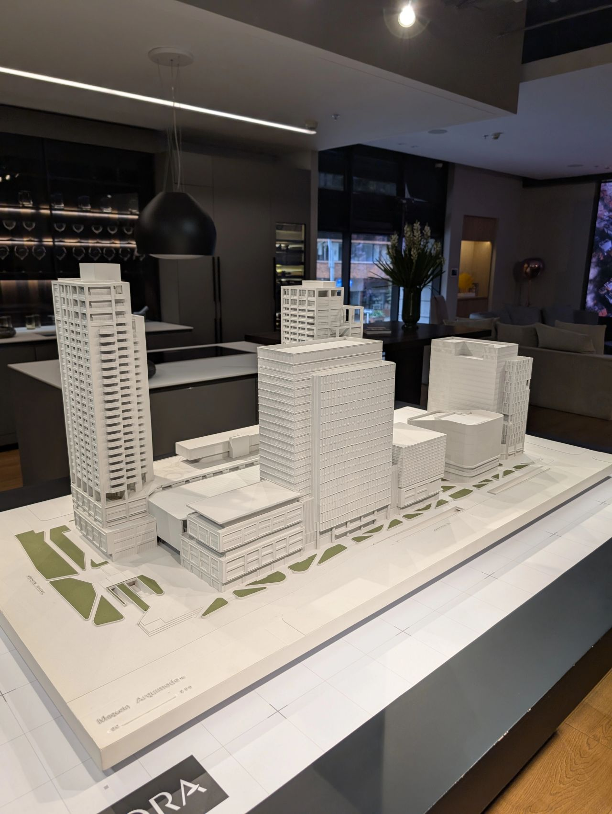

> *Originally posted on [LinkedIn](https://www.linkedin.com/posts/smuriel_emprender-es-necesariamente-montar-una-empresa-activity-7358201379942719488-zA_e)*

Does entrepreneurship necessarily mean starting a new company? 🤔

On Friday I visited [Amarilo S.A.S.](https://www.linkedin.com/company/constructora-amarilo-sa/) with [Daniel Moreno](https://linkedin.com/in/daniel-morenom). Daniel recently got featured in Forbes for [Alfred](https://www.linkedin.com/company/alfredappco/), but in his own words, today his time goes into Amarilo.

Amarilo is 1) massive, and 2) family-owned. They've been at it since 1993 and today they're the largest construction company in Colombia.

He showed me the mega-project they're building at 85th and 15th, with the same excitement and fire 🔥 as any tech founder at a Demo Day.

Incredible. Who can argue that making something like that exist (it's called Quora, by the way) isn't innovating and entrepreneuring?

Entrepreneurship is creative energy put to work building projects, at any scale and in any setting. Private companies, family businesses, multinationals, public sector, or nonprofits. Building spinoffs, new projects, pivoting existing ones. But above all, CREATING and DOING.

If you're creating, you're entrepreneuring (and it doesn't have to be a tech project 💻).

Thank you [Daniel Moreno](https://linkedin.com/in/daniel-morenom) for supporting [Ignia](https://www.linkedin.com/company/igniaeducation/) with incredible spaces (we'll have sessions on Amarilo's rooftop 🔥)... and for a couple of other surprises we'll share soon 🚀

PS: Daniel is an early riser, he always schedules meetings at 7am. First: WTF? Second: more proof that he wakes up with entrepreneurial fire 🔥

