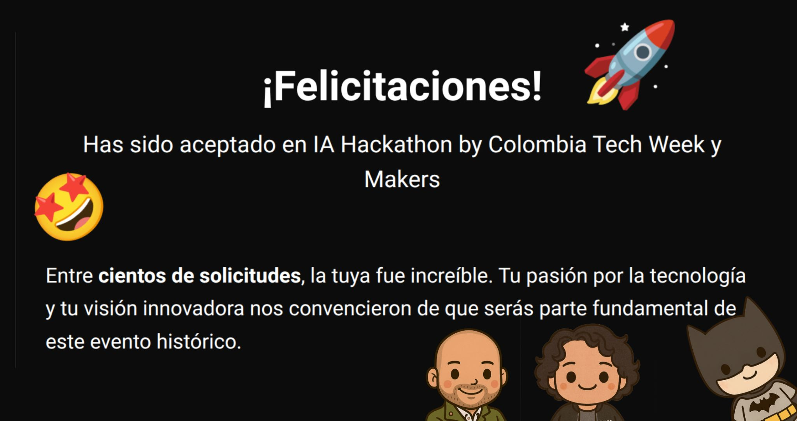

> *Originally posted on [LinkedIn](https://www.linkedin.com/posts/smuriel_colombiatechweek-activity-7358897075436036096-92QS)*

Wooooooooo 🚀 I got selected as one of the 150 Builders for the AI Hackathon at #ColombiaTechWeek — and we're going to build a bot to fight crime 🦸‍♂️ [Bruce Wayne](https://linkedin.com/in/bruce-wayne-0243b522a), we're open to tips.

[Rafael Sanabria](https://linkedin.com/in/rfsan) jumped in to apply without a second thought and got in too (how could he not... total rockstar 🧨).

What if you could report crimes in your city with just a WhatsApp voice message? Take photos instantly, no long forms?

What if reports from 5 witnesses automatically merged into a single folder, ready to hand over to authorities?

And imagine using all that data to show crime hotspots, the most common types of crimes, the times when things are happening... all through WhatsApp, accessible to anyone.

And as a bonus — making it 100% free and open source. Useful in Bogotá, Medellín, Chigorodó, but also Tokyo, Austin, Guadalajara or Cape Town.

Is it doable? No idea! We'll find out at the Hackathon. If you think of more features for the bot, drop them in DMs or the comments!

