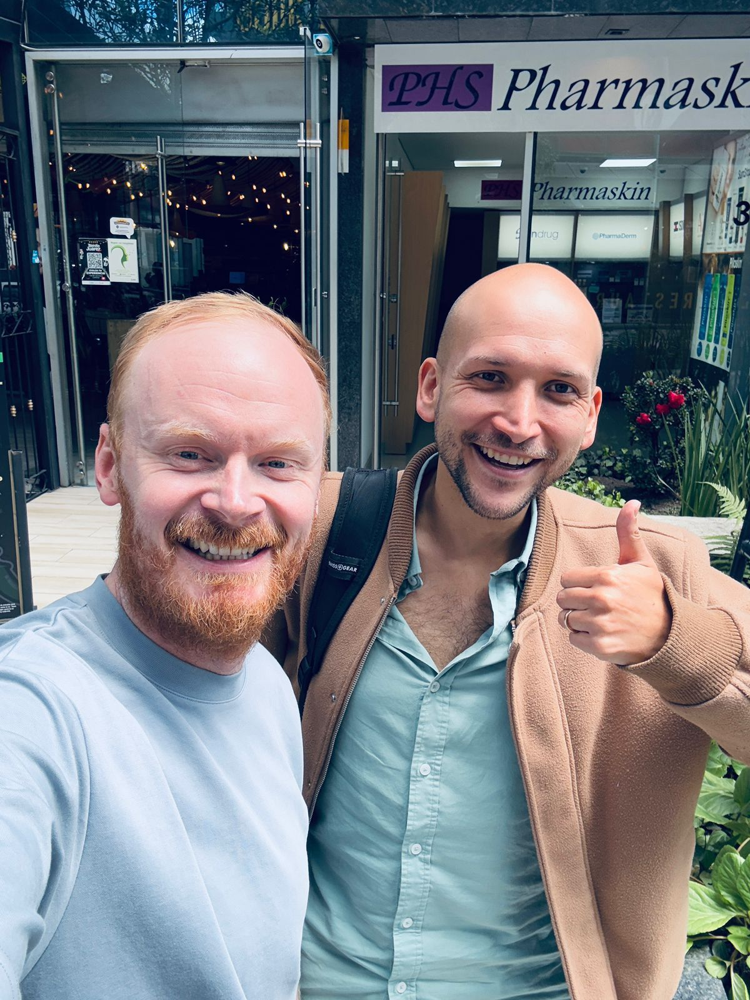

> *Originally posted on [LinkedIn](https://www.linkedin.com/posts/smuriel_esta-semana-almorc%C3%A9-con-henry-may-el-anglo-colombo-argentino-activity-7360316508545130499-Er6t)*

This week I had lunch with [Henry May](https://linkedin.com/in/henry-may), the Anglo-Colombian-Argentine 🇨🇴 🏴󠁧󠁢󠁥󠁮󠁧󠁿 🇦🇷 cool guy of the education world. Great conversation, solid restaurant — huge portions and ridiculously cheap. The restaurant at the end 🌮

We wanted to catch up on what [Ignia](https://www.linkedin.com/company/igniaeducation/) has been up to and what's happened with [Coschool](https://www.linkedin.com/company/coschoolcol/) in recent months. Highlights:

1️⃣ This is like the sixth time we've met this year and he always brings the best attitude: toward what you're building, what he's building, what the world is doing.
2️⃣ We agreed on a tough topic: entrepreneurship with kids. With everything that brings in terms of time, costs, school decisions 🥴 We both have "2 under 4" — a serious challenge.
3️⃣ He never stops building cool things. PRIMED, the socio-emotional education law, being ranked first in Edtech on LinkedIn... isn't enough — he's now cooking up even cooler stuff 🌼

Henry was one of the people who helped me most with my research for Ignia. Total rockstar 🔥. And what's coming next...

PS: The restaurant cost us 70,000 pesos.... FOR BOTH OF US 🤯 And it was big, and delicious. Zero expectations going in. Benito Juarez on 90th and 16th — highly recommended.

PS2: I demand his next video be recorded with his Argentine accent 🇦🇷

PS3: He's got 20 centimeters on me but very graciously stepped down a stair for the photo.

