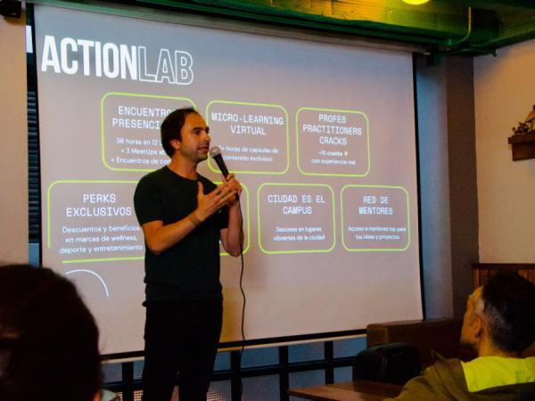

> *Originally posted on [LinkedIn](https://www.linkedin.com/posts/smuriel_la-educaci%C3%B3n-tradicional-est%C3%A1-desconectada-activity-7361859049291665409-h7mG)*

My most exciting news this week (literally 🗞️) — my partner, co-builder, partner-in-crime [Camilo Bonilla](https://linkedin.com/in/camilobonilla) was interviewed in [Portafolio](https://www.linkedin.com/company/portafolioco/) to talk about Ignia and the changes that are needed in higher education.

[https://lnkd.in/eArZbwyZ](https://lnkd.in/eArZbwyZ)

Hot take 🔥: *"More than half the value that someone gets from what they study comes from the people they meet and stay in touch with."*

Content and methodology matter, but you have to put a massive focus on building tight community through learning experiences. And with Ignia, we're betting on creating a community of **people on fire** 🔥

So proud to be building this with you, Cami 🚀

