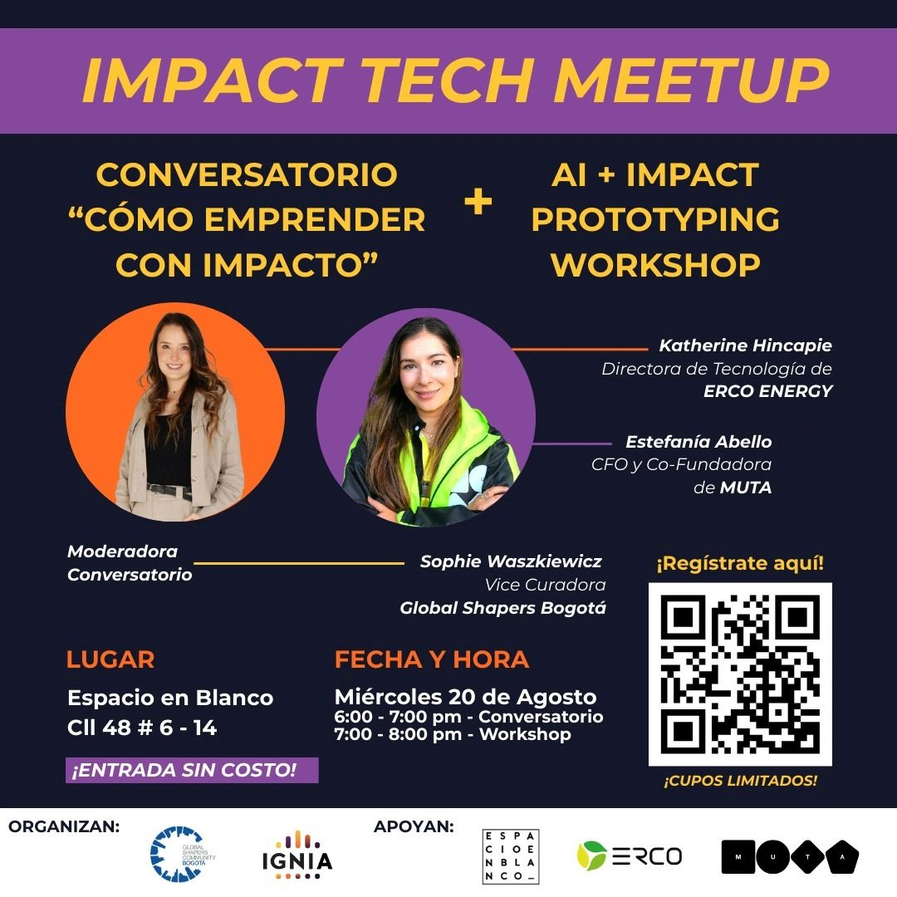

> *Originally posted on [LinkedIn](https://www.linkedin.com/posts/smuriel_el-mi%C3%A9rcoles-20-de-agosto-tenemos-un-evento-activity-7362495128726372357-dzgL)*

On Wednesday August 20 we've got a killer event 💣, free 🚀, in-person in Bogotá.

If the world of Impact and how to combine it with Tech speaks to you, this is the place to be.

A combo of Panel + Workshop — learn from experience, then learn by doing.

First, the rockstars 🔥 [Katherine Hincapie Romero](https://linkedin.com/in/katherine-hincapie-romero), [Estefanía  Abello Plata, CFA](https://linkedin.com/in/estefania-abello-plata), and [Sophie Salomé Waszkiewicz Villarroel](https://linkedin.com/in/sophie-salomé-waszkiewicz-villarroel) having a conversation about Impact Entrepreneurship.

Then, a hands-on workshop where in just 1 hour, with zero technical background, we'll use AI tools 🤖 to build a real prototype of your own impact idea or project.

Hosted by [Ignia](https://www.linkedin.com/company/igniaeducation/), [Global Shapers Community](https://www.linkedin.com/company/global-shapers-community/), [MUTA](https://www.linkedin.com/company/muta-app/) and [Erco Energía](https://www.linkedin.com/company/erco-energ%C3%ADa-s-a-s/).

Registration link 🔗 [https://lu.ma/w1fr9yco](https://lu.ma/w1fr9yco)

