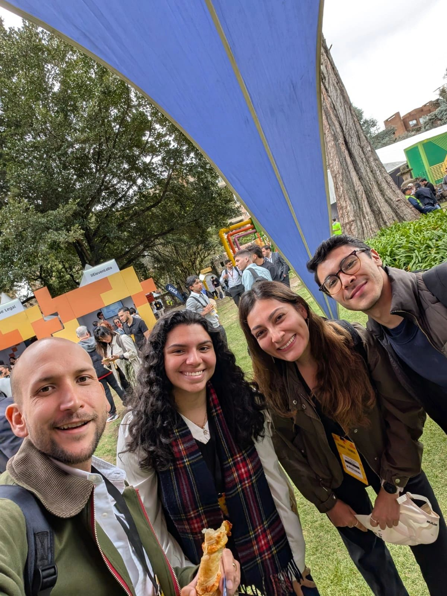
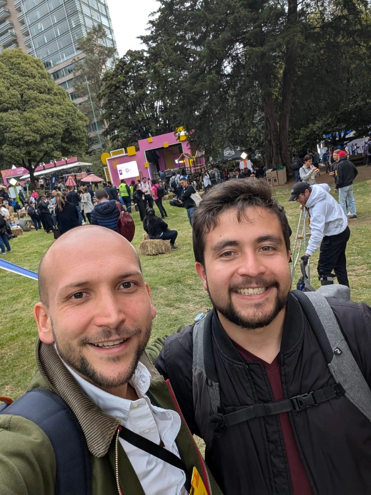
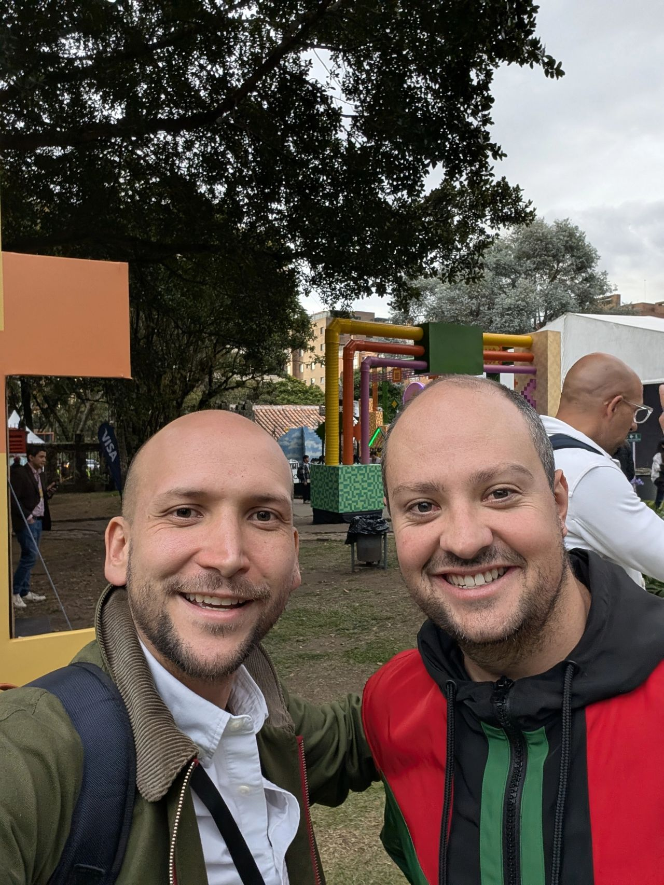
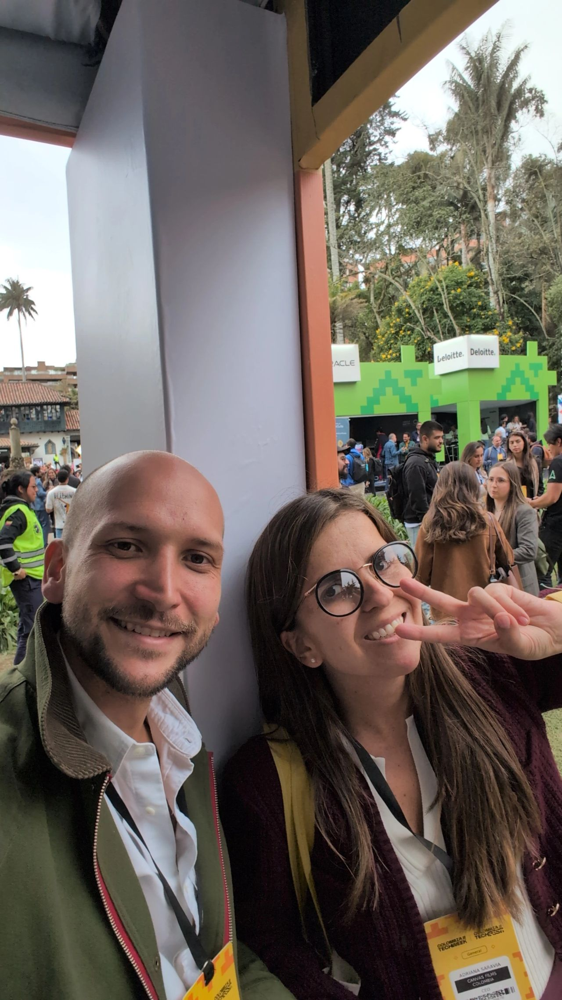
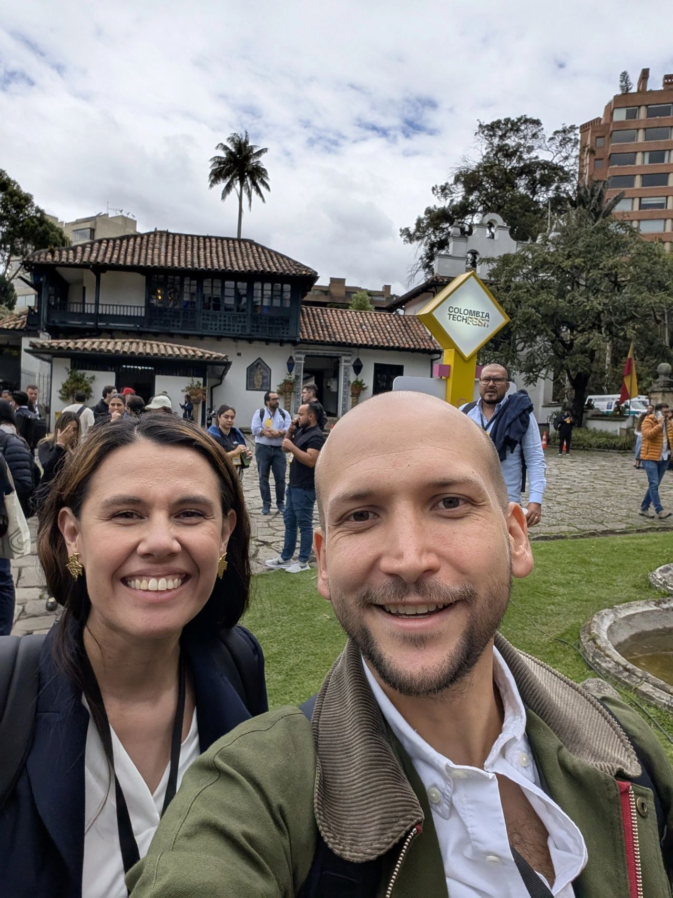
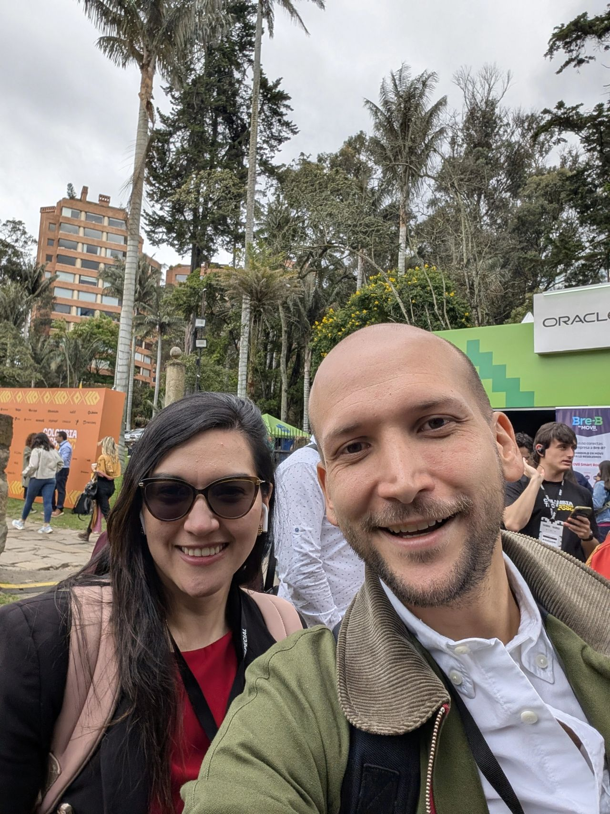
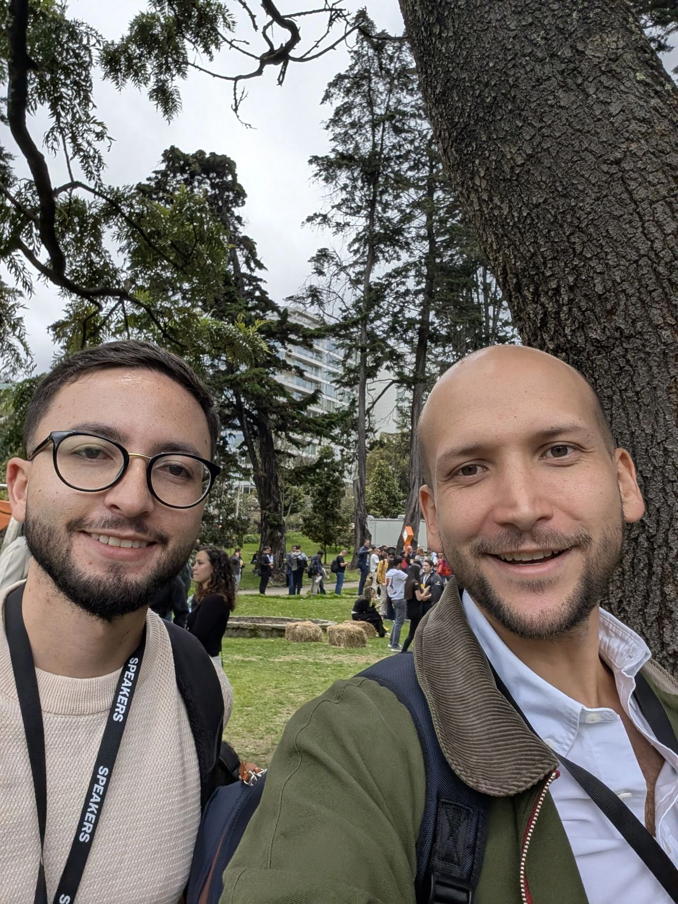
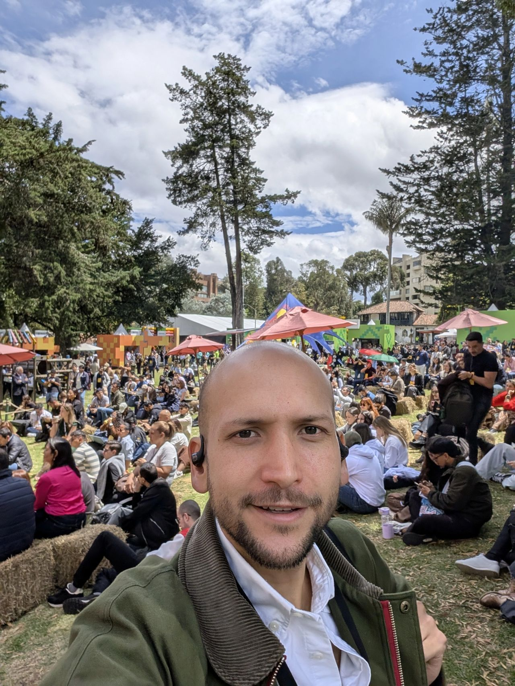

> *Originally posted on [LinkedIn](https://www.linkedin.com/posts/smuriel_colombiatechweek-activity-7364627477748404226-YCaE)*

The good, the best, and the bad from day one of the Tech Fest at #ColombiaTechWeek 🚀

😊The good: the Personal Brand workshop by [manuela villegas](https://linkedin.com/in/manuelavillegas) and [Pedro Mejia](https://linkedin.com/in/pedromejiar) + [Produteka](https://www.linkedin.com/company/produteka/). Incredibly useful and practical — I wrote down everything. Weekend post incoming with the highlights + the resources they shared 🔥

🤩The best: the people. Incredible. I had zero pre-planned meetings and still ran into tons of people + got introduced to many more.

These are just the photos I remembered to take — there were at least 4x as many moments I didn't capture, photos that didn't turn out, or someone else took and they're floating in the limbo of someone else's phone ([Carlos Ignacio Patiño-Florez](https://linkedin.com/in/cpatinof) [Maria Camacho](https://linkedin.com/in/mariacamacho22) 👀). I didn't stop talking, and I saw everyone doing the same — connecting everywhere.

😵‍💫The bad: the organization of the talks/workshops. There wasn't enough space for that many people 😅, all workshops overbooked, the workshop space too small for its listed "capacity," the talks on one stage started over an hour late, and at the other one I could never even get in. Missing [Dan Macías](https://linkedin.com/in/sandlerdanmacias)'s workshop because of capacity really hurt.

The bad is tiny compared to everything else — next year I'm sure they'll learn and fix it.

Incredibly high value. [Nicolás Cruz](https://linkedin.com/in/nicolascruzf) [Maria José Echeverri](https://linkedin.com/in/maria-josé-echeverri-giraldo) [Andrés Bilbao](https://linkedin.com/in/andres-bilbao) [Laura Marcela Forero](https://linkedin.com/in/lauramarcelaforero) — thank you for creating this and bringing so much fire 🔥 together in one place.

