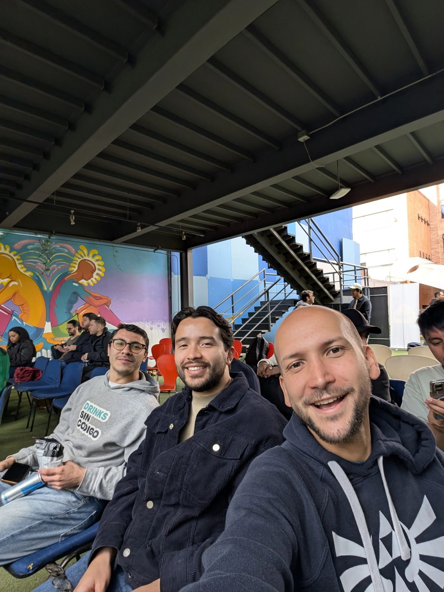

> *Originally posted on [LinkedIn](https://www.linkedin.com/posts/smuriel_iahackathon-activity-7365019827192668160-V2Sg)*

Second big event of [Colombia Tech Week](https://www.linkedin.com/company/colombia-tech-week/): The #IAHackathon 👨🏼‍💻👨🏻‍💻👨‍💻

So exciting to be building alongside these two rockstars — [Rafael Sanabria](https://linkedin.com/in/rfsan) [Sebastian Martinez Hoyos](https://linkedin.com/in/sebasmartinezhoyos).

We're building a WhatsApp experience to fight crime: letting any citizen report it with text, audio, photos, or videos and know what to do next 🚀

Other features that have come up:
- Panic Button (that automatically contacts the authorities)
- Analytics (crime heat maps and other statistics)
- Report linking (connecting reports of the same crime from multiple citizens)

What other features do you think we should add?

