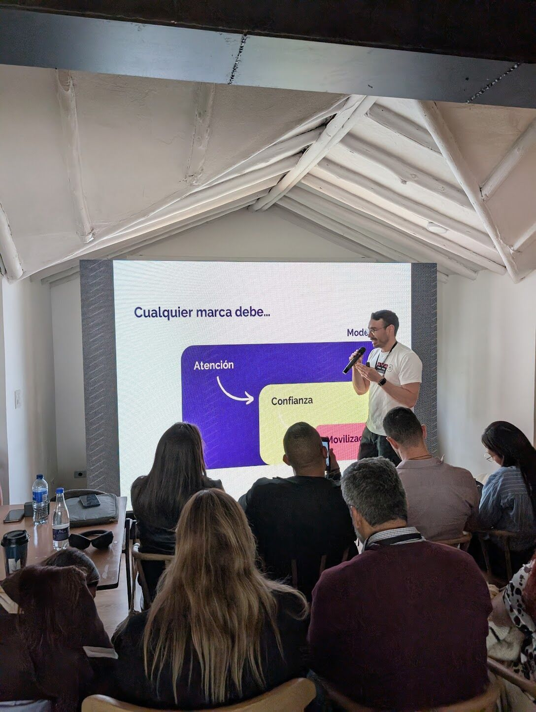

> *Originally posted on [LinkedIn](https://www.linkedin.com/posts/smuriel_el-viernes-pasado-fu%C3%AD-al-taller-de-marca-activity-7366099704356454400-AN5c)*

Last Friday I went to the Personal Branding workshop by [Pedro Mejia](https://www.linkedin.com/in/pedromejiar) and [manuela villegas](https://www.linkedin.com/in/manuelavillegas). I took notes on EVERYTHING. Here's a summary in 10 points ⤵️

Link to the most relevant slides in PPT for anyone who wants to see them: [https://lnkd.in/eyErMXeK](https://lnkd.in/eyErMXeK)

1. The personal brand funnel on social media goes: Who I Am ➡️ Attention ➡️ Trust ➡️ Mobilization (monetization).

2. Who I Am is what "makes you so unique that it lets you provide value." Not what makes you similar to everyone else.

3. That Who I Am can be expressed through a Jungian Archetype ([https://lnkd.in/eND2NwFS](https://lnkd.in/eND2NwFS)). Or [manuela villegas](https://www.linkedin.com/in/manuelavillegas)'s version... the Disney character you identify with most. Mine... Hiro Hamada from Big Hero 6 🤖  || The Wizard 🧙‍♂️  + The Artist/Creator 👨‍🎨

4. From that character and their niche, you need to tell a captivating story. There are 7 basic narrative frameworks for this ([https://lnkd.in/eD5bP89n](https://lnkd.in/eD5bP89n)). My favorite - The Voyage and Return 🧳

5. You have to carve out time for this. Block calendar time to CREATE content and to INTERACT with your audience. Then, close the LinkedIn tab (even if you're addicted).

6. The protagonists aren't us — they're our ideas and our audience. That means sparking conversations is the most important thing.

7. Personal brand isn't self-promotion 💡 It's promotion of ideas. If we share our ideas, we create conversation.

8. Hey, if you have LinkedIn and no time to post, at least make your profile look good (the bare minimum!). Especially your Banner, Photo, and Headline.

9. Focus on your audience's Monday problem. What's going through their head while they're sipping their first coffee ☕  of the week?

10. Learn to tell stories. "Data informs, stories sell" (no shade to [Felipe Segura Vásquez](https://www.linkedin.com/in/felipesegurav), absolute legend!)

---------

The truth is this stuff really works. In the last 2 months I went from top 300 Colombia to Top 133 just by posting daily about what moves me most (and using a few things from [RUBICA](https://www.linkedin.com/company/rubicaconsultores/)'s branding workshop ❤️).

At TechFest, several people came up to me because of my posts. 50% of Action Lab leads came from my LinkedIn posts (and we're already at 30 signups!)

What else do you think is important for connecting with your audience and keep delivering value through content? At the RUBICA workshop, one thing that came up was the importance of having a crystal-clear audience and core topics.

