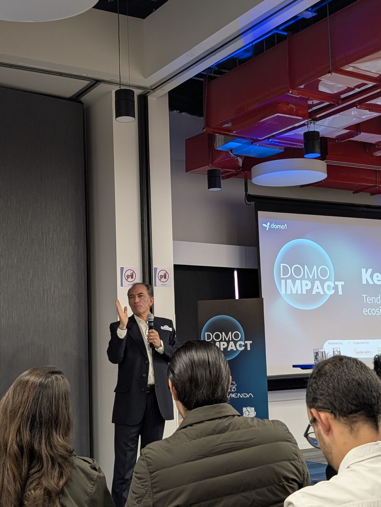
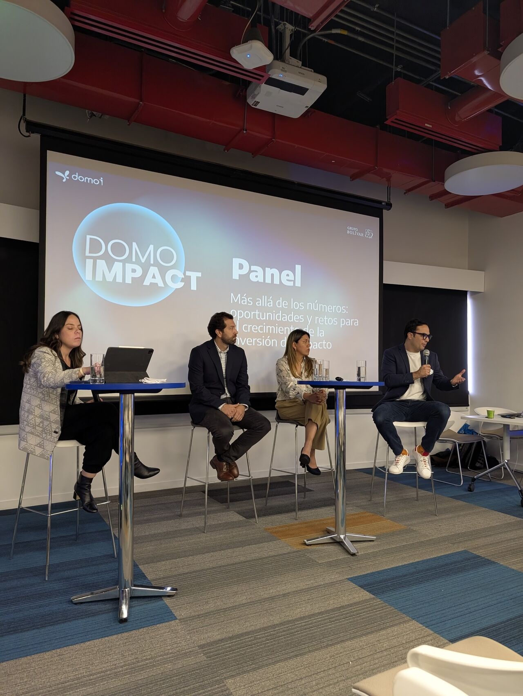
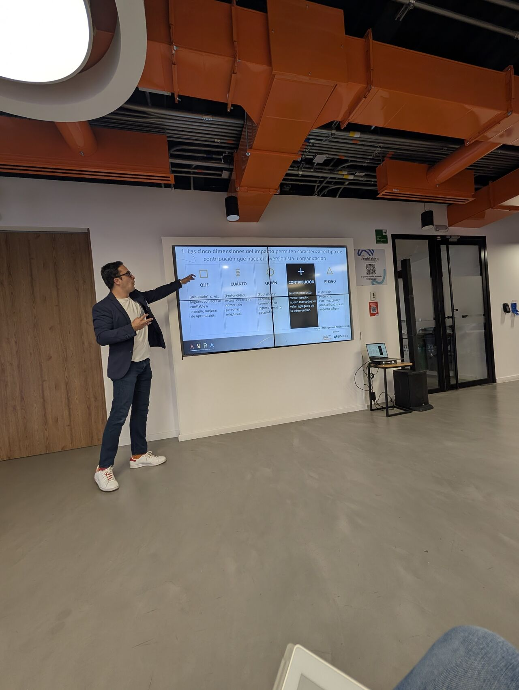
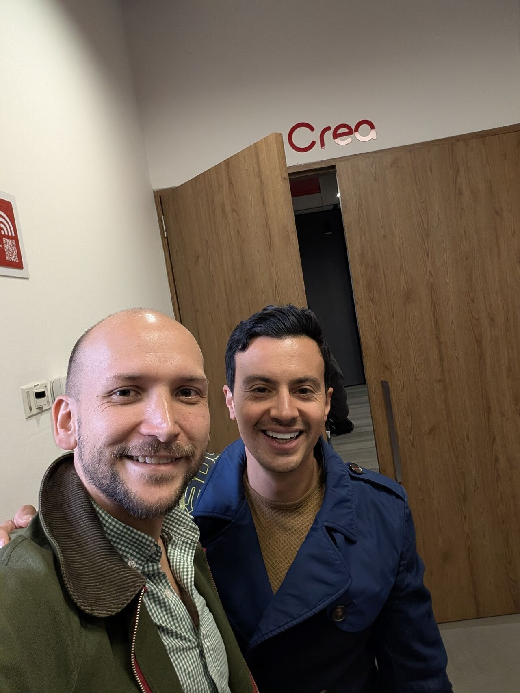

> *Originally posted on [LinkedIn](https://www.linkedin.com/posts/smuriel_frase-del-mes-de-mauricio-samper-el-activity-7366232462214995968-m686)*

Quote of the month (from [Mauricio Samper](https://www.linkedin.com/in/mauricio-samper-38541622)) -> The world is ready to move from Capitalism 1.0 (maximize shareholder value) to Capitalism 2.0 (maximize stakeholder value) 🧨

In other words, stop building companies that only think about money, and start building ones that think about everyone's wellbeing — and that also make money.

Today I was at the launch of AURA, an incredible initiative by [Inversor](https://www.linkedin.com/company/inversor/) and [Fundación Bolivar Davivienda](https://www.linkedin.com/company/fundacion-bolivar-davivienda/) to energize the impact investment ecosystem 🚀

Highlights:
- Mauricio was incredibly inspiring. What a vision 🔥

- Seeing pitches and meeting [Natalia Cano Sokoloff](https://www.linkedin.com/in/natalia-cano-sokoloff) was awesome. I've been [Docokids](https://www.linkedin.com/company/docokids/)' most loyal customer since day one — my go-to baby shower gift 👶

- A powerful panel discussion. The highlight for me: watching the data-driven approach that [Felipe Orjuela](https://www.linkedin.com/in/felipe-orjuela-a09a7380) showed from [SVX Colombia](https://www.linkedin.com/company/svx-colombia/) to understand the impact ecosystem. PS, check out the report they just released — it's pinned on SVX's profile.

- A workshop showcasing a framework for impact funds, with a small group, guided by [David R. Sánchez](https://www.linkedin.com/in/davidrsanchezc) from [Amplo Kaya](https://www.linkedin.com/company/amplokaya/). Great content.

Met:
1️⃣  [Luz Mila Lancheros Carvajal](https://www.linkedin.com/in/luzmilalancheros). Lucky to have sat next to her. Talking about dreams of more flexible funds.

2️⃣ [Andrés Felipe Pulido](https://www.linkedin.com/in/afpulido) (after I asked out loud whether we need more investment in the space between tiny startups and unicorns) — and luck had us sharing a ride back to keep talking about that and more.

3️⃣ [Ana María Quiroz](https://www.linkedin.com/in/ana-maría-quiroz-1a7a959) - Absolute rockstar!! Moving AURA forward full speed. Super excited to see how we'll collaborate in the future.

What a great day. And what AURA has coming is going to be a before-and-after moment for impact investment.

Has anyone ever held back from launching an impact venture because of lack of capital? If there were more impact investment, what would you launch?

PS [César Andrés Rodríguez](https://www.linkedin.com/in/césar-andrés-rodríguez-84450733) didn't see you there, but thanks for being my first teacher on this topic.

