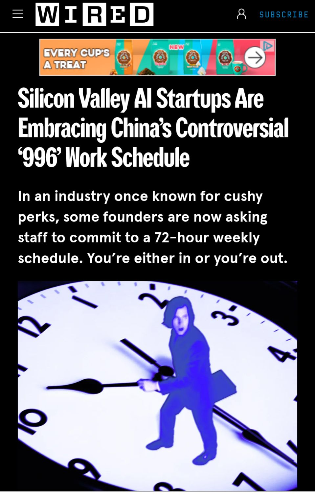

> *Originally posted on [LinkedIn](https://www.linkedin.com/posts/smuriel_996-me-acabo-de-enterar-de-996-y-lo-odio-activity-7370113917223870464-c-K4)*

996. I just found out about 996, and I hate it ❌

996 means working from 9am to 9pm, 6 days a week.

It's the work culture of many tech startups in China.

And apparently, it's now spreading in the USA / San Francisco because of the AI boom.

I really hope it never catches on here.

