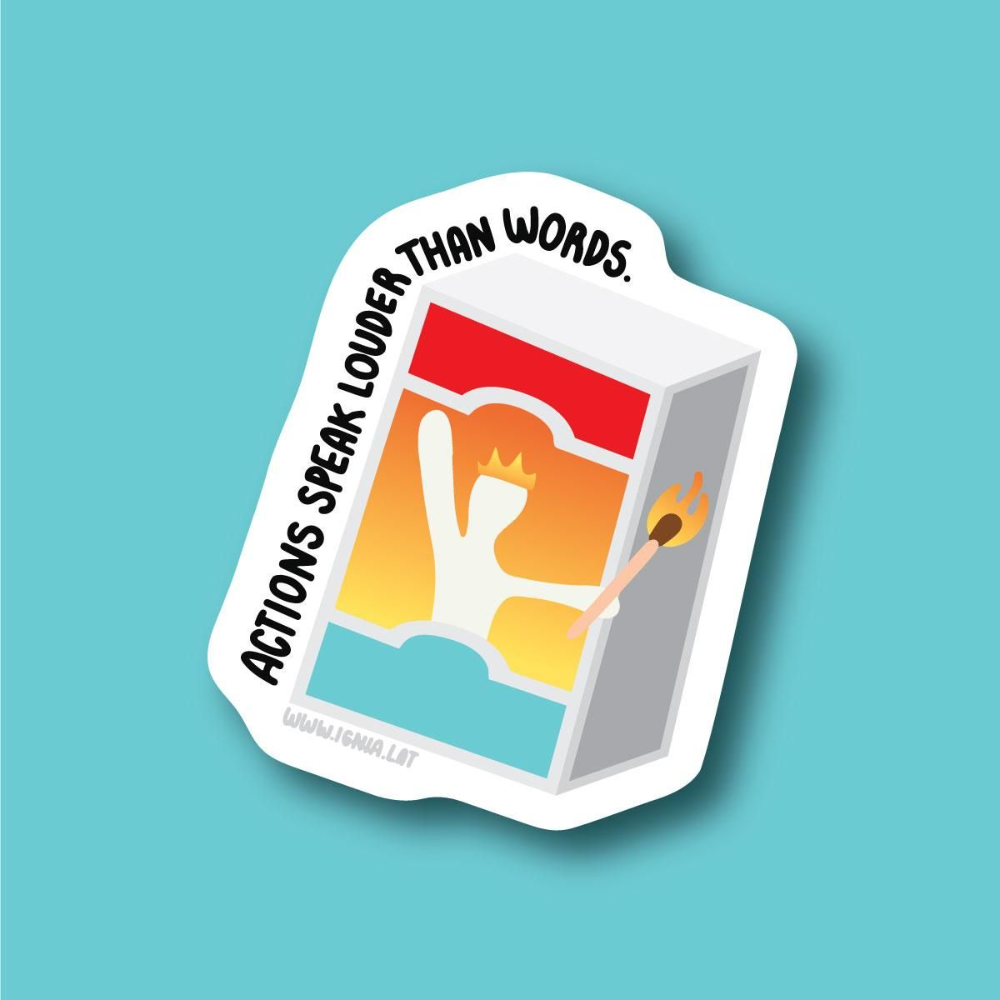
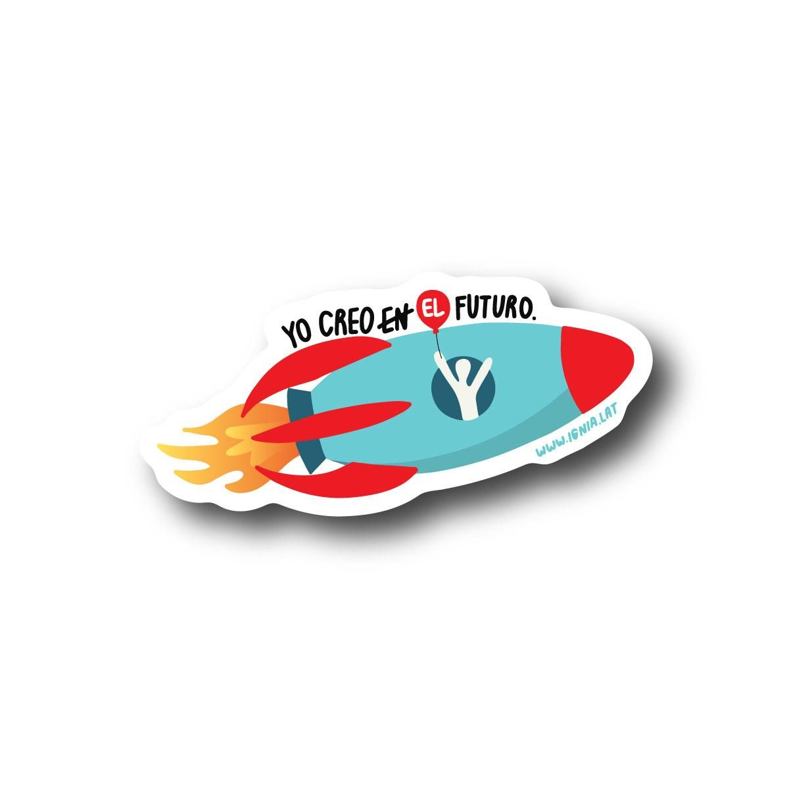
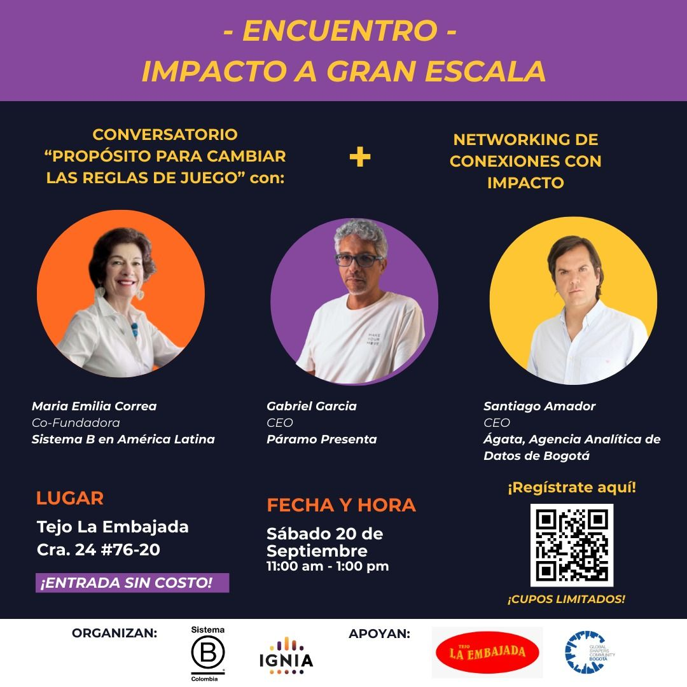

> *Originally posted on [LinkedIn](https://www.linkedin.com/posts/smuriel_gratis-evento-merch-cool-torneo-de-activity-7373347471588212736-MAKf)*

Free — Event + Cool Merch + Tejo Tournament 🔥 for driven people only.

At Ignia we wanted unique merch. At Vassar we found UnPocoLoco, a venture by [Sara Peña Marulanda ](https://www.linkedin.com/in/sara-peña-marulanda-586453258).

She started it at 16 (!!!), she's now 22 and going strong. She makes amazing stickers in her shop and custom designs for anyone who needs them. Leaving the link in the comments ⬇️

About the Event, Merch and the Tejo — This Saturday September 20th we have a 🔝 event:

1. Panel with 3 rockstars of large-scale projects:
- Gabriel Garcia - CEO of Paramo Presenta (yes, the people behind EstereoPicnic, Baum, Cordillera, etc). Events with hundreds of thousands of attendees per year.
- [Santiago Amador](https://www.linkedin.com/in/santiago-amador-91b1733b) - CEO of [Ágata](https://www.linkedin.com/company/agatadata/) and founder of Bogotá's Innovation Lab. Every project this guy builds touches millions of people.
- [Maria Emilia Correa](https://www.linkedin.com/in/mariaemiliacorrea) - Founder of [Sistema B](https://www.linkedin.com/company/sistema-b/) in Latin America. The ultimate rockstar in sustainability.

2. Networking with the entrepreneurship and impact ecosystem.

3. Optional Tejo Tournament in the afternoon 🧨

Register at: [https://luma.com/x42s0j1m](https://luma.com/x42s0j1m)

Everyone who registers AND comments "ESCALA" on this post will get a cool merch kit at the event (plus a few other surprises that day).

What experts/speakers/rockstars would you want us to bring to our next event? What topic would you want it to be about?

