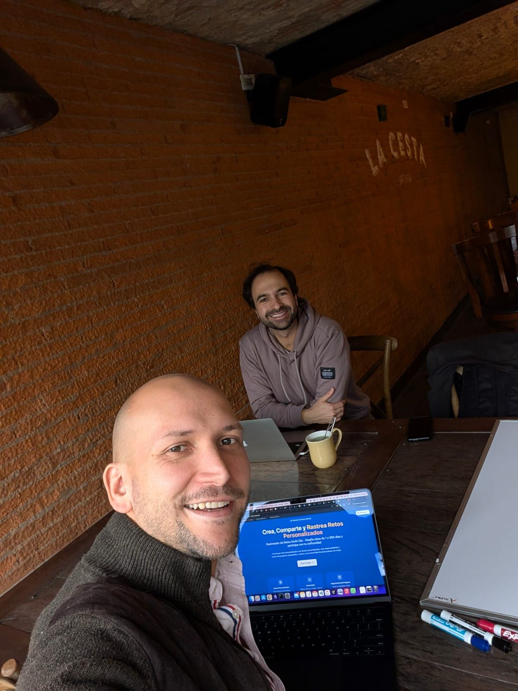

> *Originally posted on [LinkedIn](https://www.linkedin.com/posts/smuriel_hay-que-sacarle-tiempo-a-pensar-en-estrategia-activity-7378484593873821697-Fruy)*

You have to make time for strategy.

If day-to-day execution is the walking, strategy is the road. Without a road, there's no way to plan where you're going.

[Pablo Armida](https://linkedin.com/in/pabloarmida) and [Fernando Sucre](https://linkedin.com/in/fernandosucre) (plus the entire C-Suite at R5) showed me just how critical it is to stop thinking about operations for a moment and put real energy into strategy.

We'd go away for a full week (our offsite) just to think and discuss. The most productive weeks of the year, one per quarter.

Today and tomorrow is my first strategy session with [Camilo Bonilla](https://linkedin.com/in/camilobonilla). So excited 🔥  We'll be sharing what's coming next for Ignia soon!

