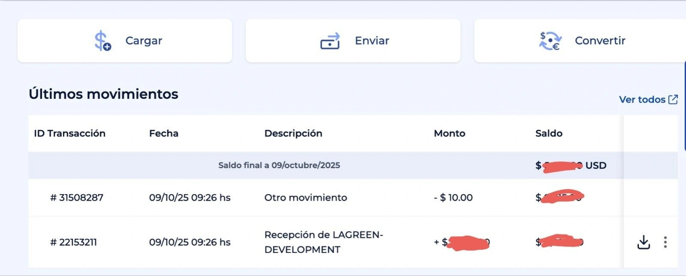

> *Originally posted on [LinkedIn](https://www.linkedin.com/posts/smuriel_hace-unas-semanas-postee-que-necesitaba-una-activity-7382406554861457408-6lh7)*

A few weeks ago I posted that I urgently needed a bank account that could receive SWIFT transfers.

Happy to report that the top recommendation — Global66 — WORKED 🔥

Because we had the account set up in less than a day, we were able to sign a contract with our client right then and there, and yesterday we received the first payment from Germany.

Thank you [Tomas Bercovich](https://linkedin.com/in/tomas-bercovich-589b914) and team. Legends!

PS: Our "finance stack" — Bold + Global66 has been great, in case anyone is still on the fence about where to open accounts or how to get off traditional banking.

