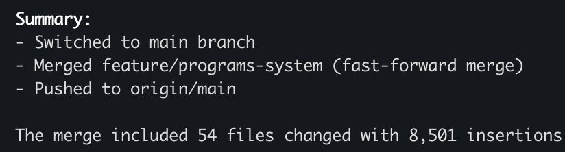

> *Originally posted on [LinkedIn](https://www.linkedin.com/posts/smuriel_esta-semana-tuve-un-all-nighter-de-9pm-a-activity-7384580159053561856-Jsm2)*

This week I had an all-nighter from 9PM to 3:30AM 🌃 — and in one night I did what would have easily taken 2 months before (including a junior dev).

I'm always going on about work-life balance. But working/coding at night is just delightful. No meetings, no calls, no WhatsApps. Just flow.

Combine that with Claude Code and I produce incredible things. I genuinely think it's 40x my old output. You just have to know how to break things into pieces, make solid plans, and things come out right — good architecture, tests, and it even looks clean 🌈

PD: Ignacio is now multi-program — it can support and hold context for any educational program, with customizable thematic multi-agents and student-level milestone/progress/blocker tracking and analytics 🔥 It's no longer just in the Action Lab — starting today it's supporting [Banco de Bogotá](https://www.linkedin.com/company/banco-de-bogota/)'s Sustainable Hospitality program, soon [Sistema B](https://www.linkedin.com/company/sistema-b/)'s program... or yours. [https://ignacio.ignia.lat](https://ignacio.ignia.lat)

▶️ If anyone wants to use Ignacio in their educational program or project, reach out ◀️

PS2: The Claude Code for Devs program is coming soon, so your team can also produce 40x. Who's interested, or wants their dev team to join?

