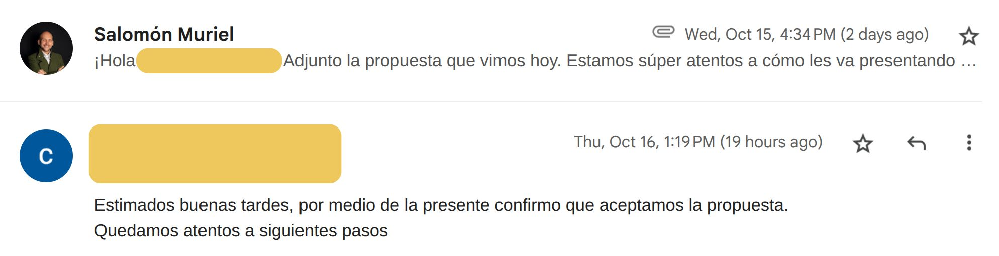

> *Originally posted on [LinkedIn](https://www.linkedin.com/posts/smuriel_nos-lleg%C3%B3-el-correo-m%C3%A1s-emocionante-del-mes-activity-7384944987936964608-ewp-)*

The most exciting email of the month just landed 🤩

There's no bigger rush — building a differentiated value proposition, co-creating it with the client, putting love into the presentation and the relationship... and having it all come together.

Applying everything that cracks like [Carlos  Echeverry](https://linkedin.com/in/carlos-echeverry), [Santiago Cortes Calle](https://linkedin.com/in/santiagocortescalle), and [Laura Sánchez M.](https://linkedin.com/in/laura-sanchez-m) taught me — sales with care, follow-through, and solid work (this is a repeat client ❤️ ) — things happen.

