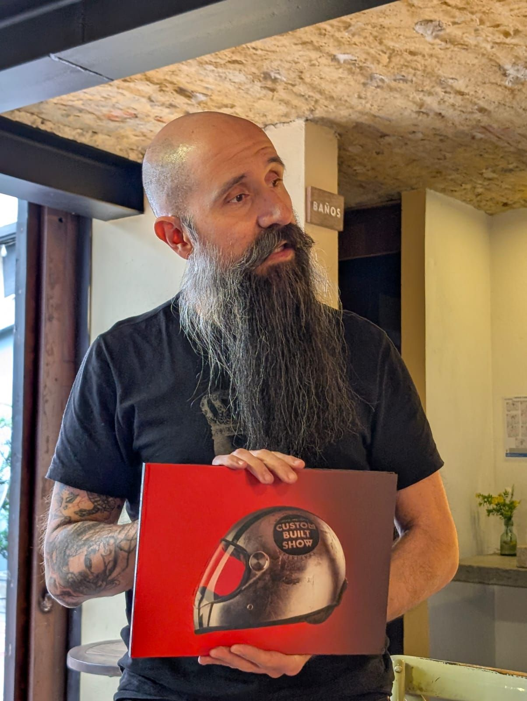

> *Originally posted on [LinkedIn](https://www.linkedin.com/posts/smuriel_que-machera-es-hacer-conexiones-de-verdad-activity-7387223769091559424-6jYp)*

There's something special about making real connections — not out of business interest, but out of genuine curiosity about who someone is and what they do.

That doesn't mean the relationship can't have a commercial side to it — but it should come from synergy, not from the urge to sell.

Today at our Thursday Coworking we had about 20 people for lunch (as always). Among them, a regular at Ignia's spaces, [Camilo Ramírez](https://linkedin.com/in/camiloramirez).

Camilo, for no reason other than to connect, decided to bring his books from the Custom Built Show — an event he ran for several years to serve another community he's passionate about: motorcycle customizers.

1. What a community. Tiny, passionate niche. There are probably 500 people doing that in Colombia.
2. What a thing to do — building something big for that community.
3. What a move — deciding, just because, to tell the whole story and bring 5 books to give away. Sharing his passion 🔥

Every Thursday I feel like we're doing exactly that — building real connections with other people who have fire in their veins.

What other communities do you know where you feel genuinely alive just being there? We want to find them — and connect for real.

