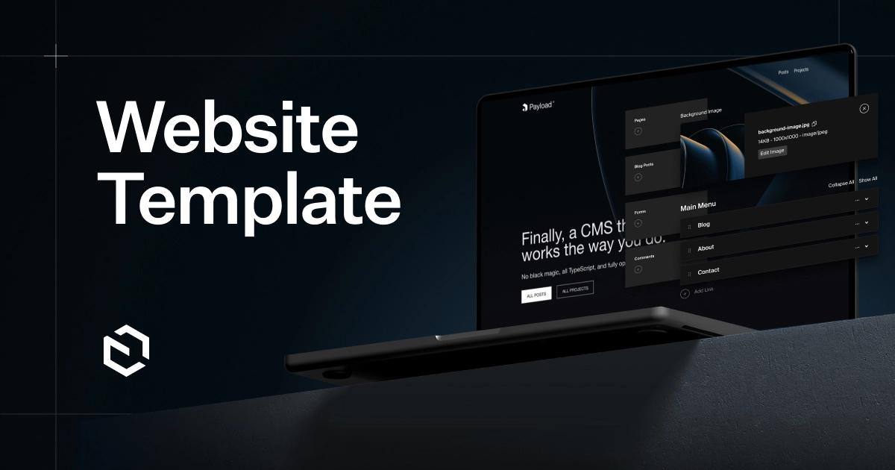

> *Originally posted on [LinkedIn](https://www.linkedin.com/posts/smuriel_payload-website-template-activity-7388964959944187904-00xX)*

Have you tried Claude Skills yet? They're a Wix killer 👋

You can now give Claude (web or Code) a step-by-step guide for completing a task, and it'll repeat it autonomously without supervision.

I recently rebuilt our programs page (you can see a work in progress at [https://lnkd.in/efg2ZKhu](https://lnkd.in/efg2ZKhu)).

I set up a self-hosted CMS (Payload — loved it). It has a nice API for defining anything — courses in our case.

Then it hit me: why not have Claude build the course for me?

I give it the details and photos, it figures out what goes where in each section, uploads everything, and publishes it.

I even hand it the video and it automatically optimizes it, pulls a 15-second preview, and uploads both.

And boom 🤯 — instant course drafts. Saves me hours.

I used this to draft our own programs, including a Product Management course with [María Alejandra López Concha](https://linkedin.com/in/malejandralopez), and more. 5 minutes each!

Skills work for any repeatable process. I think it's a bigger game-changer than MCPs, honestly.

