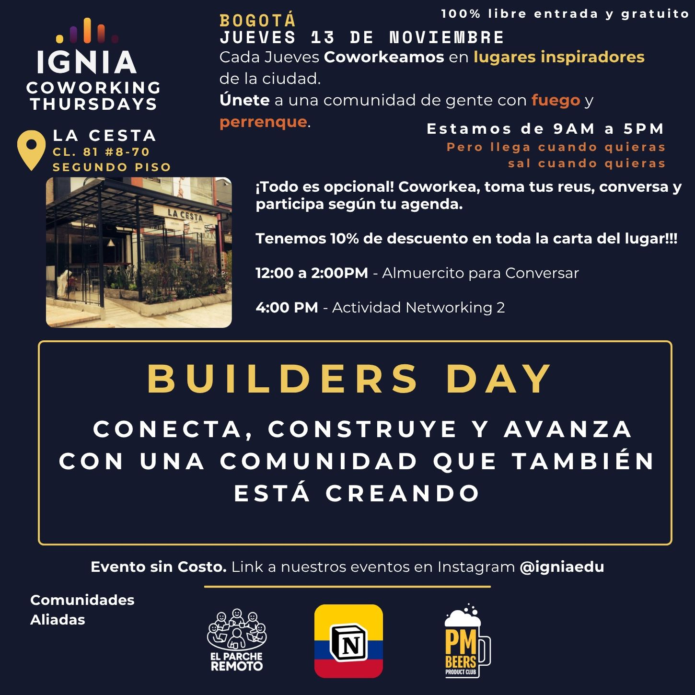

> *Originally posted on [LinkedIn](https://www.linkedin.com/posts/smuriel_este-jueves-en-bogot%C3%A1-tenemos-el-builders-activity-7393725077910941697-NAlA)*

This Thursday in Bogotá we have BUILDERS DAY: Connect, build, and move forward with a community that's also building exciting projects with fire 🔥

Whether you're just ideating or already operating, whether you want to or already have a company, foundation, or intrapreneurship project — traditional or tech — learn and grow alongside peers and mentors.

Everyone's invited to get out of isolation, cowork, and build alongside a great crew. We'll have the Ignia community + special guests supporting projects with their experience.

100% free entry! And we have a 10% discount on the entire menu 🥪

Location: La Cesta - Cl. 81 # 8-70 | Second Floor
Day: Thursday, November 13
Time: 9AM to 8PM (but come and go whenever you want, no problem)

Partner Communities: Ignia, [El Parche Remoto](https://www.linkedin.com/company/parche-remoto/), [Notion Colombia](https://www.linkedin.com/company/notion-colombia/), [Pm Beers-Product Club](https://www.linkedin.com/company/pmbeers/)

Registration link in comments.

PS — if you comment "BUILDER" + register + show up, I'll personally give you a free consulting session on your business idea 🚀

