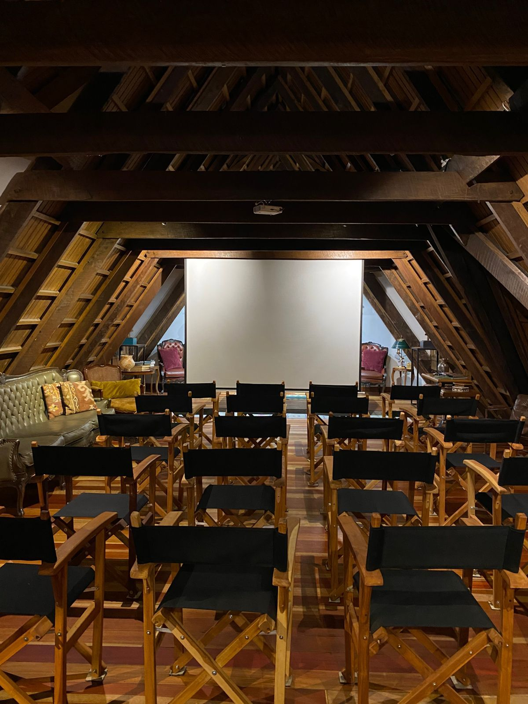

> *Originally posted on [LinkedIn](https://www.linkedin.com/posts/smuriel_en-unas-horas-es-el-cierre-del-action-lab-activity-7402070104550633472-JRMi)*

In a few hours, it's the closing of Action Lab 1.0 🔥 34 Fellows. 21 incredible teachers. A dream — reinventing higher education. Today, the first step on that road is real.

As I wrote at the beginning, 3 months ago — they told us it wasn't going to work. That it wouldn't sell. That it would fall apart. That nothing would come of it. That no — because it had never been done this way before.

YES WE CAN.

YES WE CAN dream big.

YES WE CAN challenge the old mental frameworks.

YES WE DID IT — built the program, created community, launched projects, and kickstarted paths of growth.

And there's more to come.

Infinite gratitude to the believers. Those who said yes it could be done 🚀. To the 34 brave souls who jumped into the unknown — and gave us their fire to start the flame. To the legends who gave us their time and knowledge.

Thank you to those who keep believing. We already have 15 fellows for Action Lab 2.0 — and we're going for 40. Plus other programs. Other experiences.

Yes we will, this and more.

[Camilo Bonilla](https://linkedin.com/in/camilobonilla), partner — we're going to make it. I know we can.

