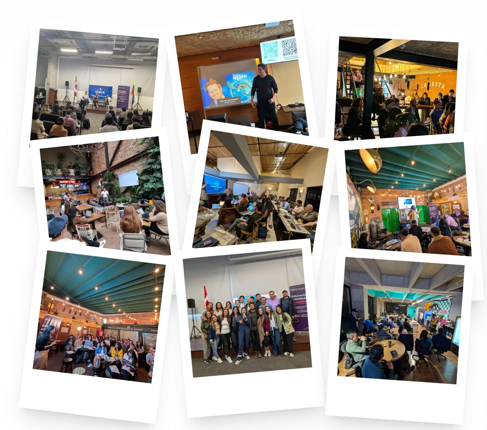

> *Originally posted on [LinkedIn](https://www.linkedin.com/posts/smuriel_la-comunidad-presencial-est%C3%A1-de-moda-y-activity-7405251907549679616-SVbs)*

In-person community is trending — and it's not a coincidence.

On platforms like Meetup, Luma, and Eventbrite, in-person events have grown between 25 and 40% over the last 2 years.

Here's why:

1. **The loneliness economy.** The post-pandemic era left us "hyper-virtualized," "hyper-connected" — and hyper-lonely 😥

2. **The rise of remote work.** Working remotely, we're more isolated — but we have more flexibility. That creates the possibility of having a "third place."

3. **The differentiation challenge** — in a world where all online communities start to look the same, showing up in person becomes a real differentiator.

4. **Insane engagement** — there's no better way to build engagement than face-to-face.

I like imagining a future where tech doesn't drive us apart, but actually helps us come closer together.

Platforms like Luma become the logistics layer for bringing people together — not just scheduling another webinar full of black squares.

PS — Photo from our Thursday Coworking & Meetups. We're 6 solid months in. It's been incredible to watch them grow 🔥

