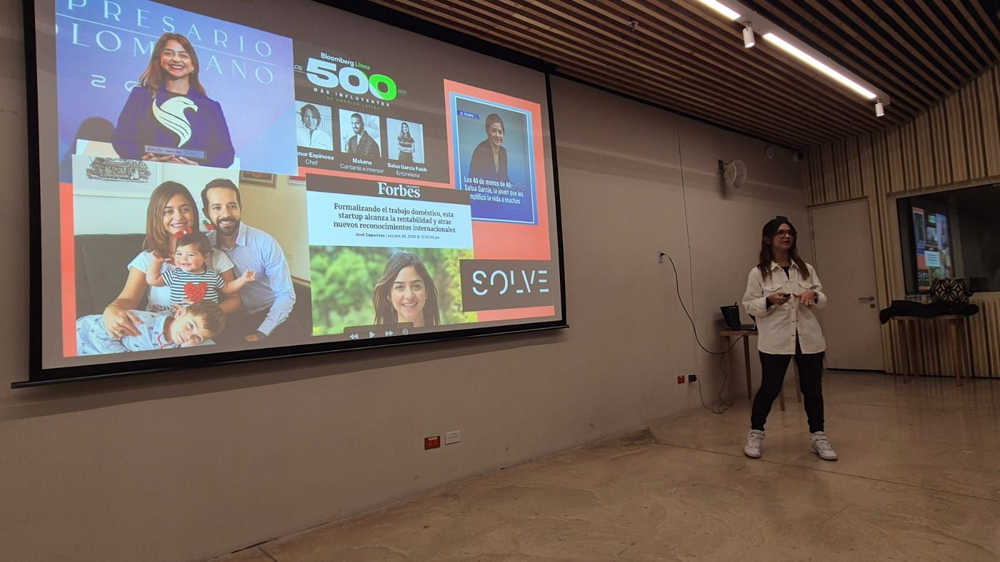
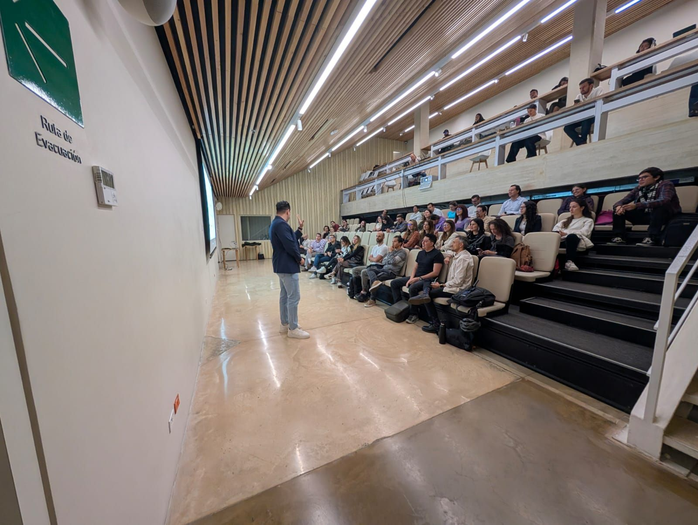
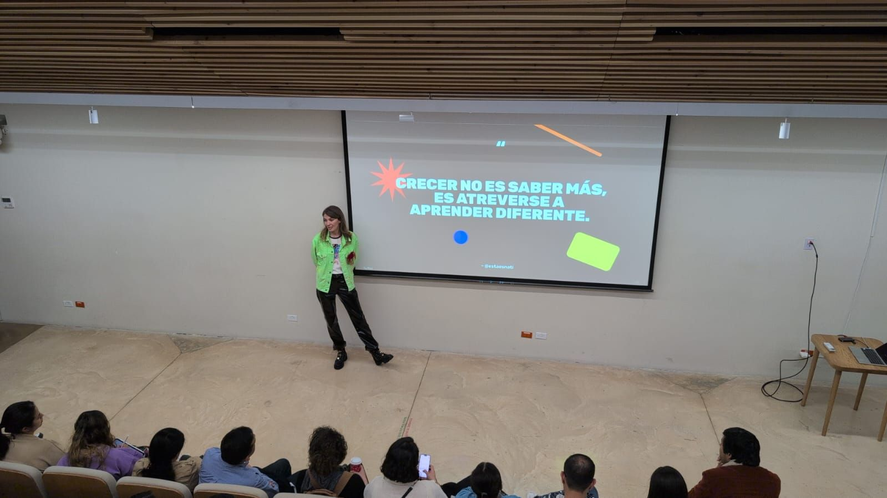
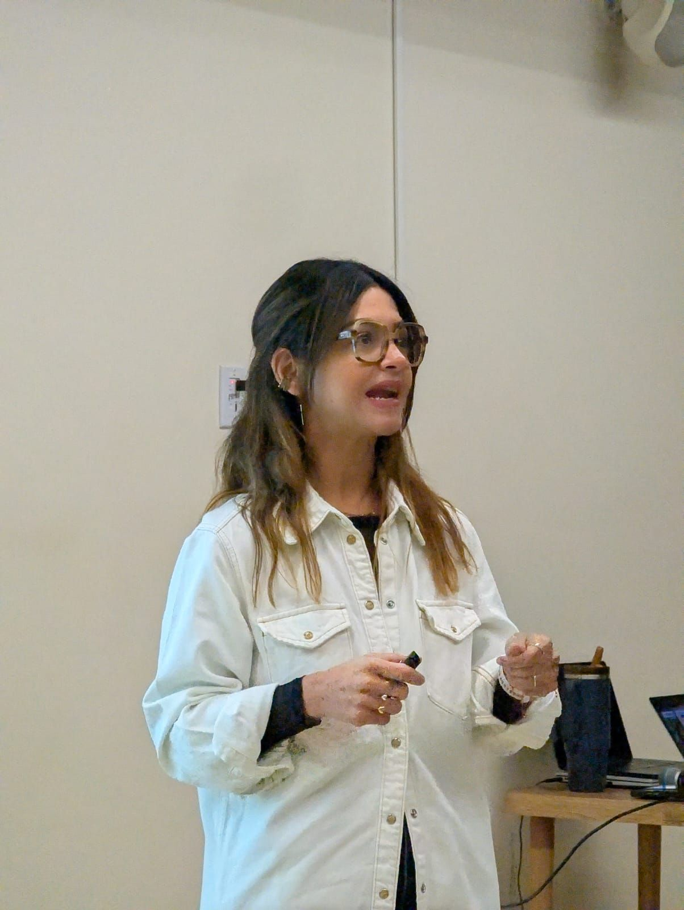
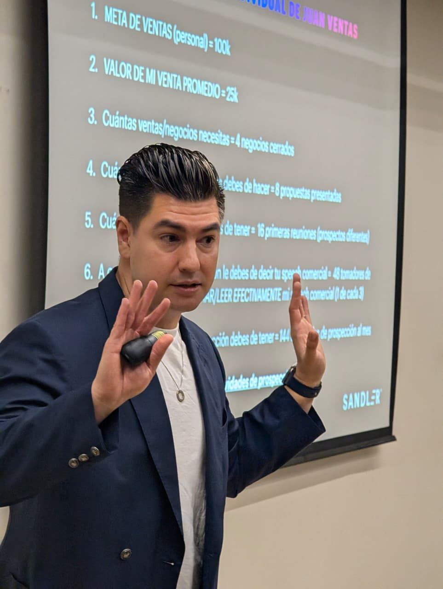
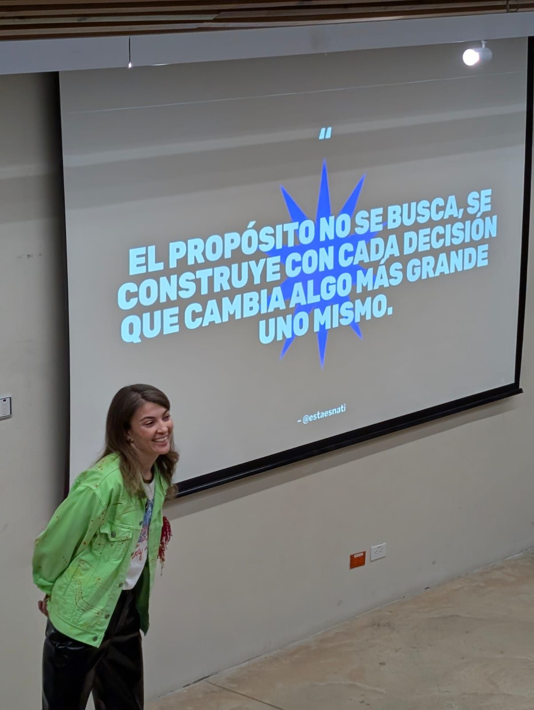
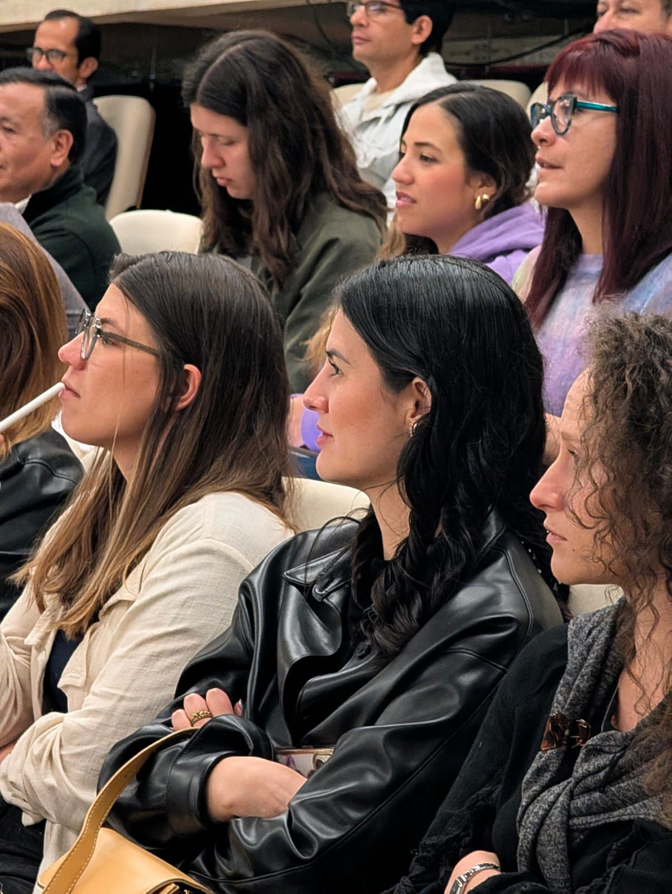
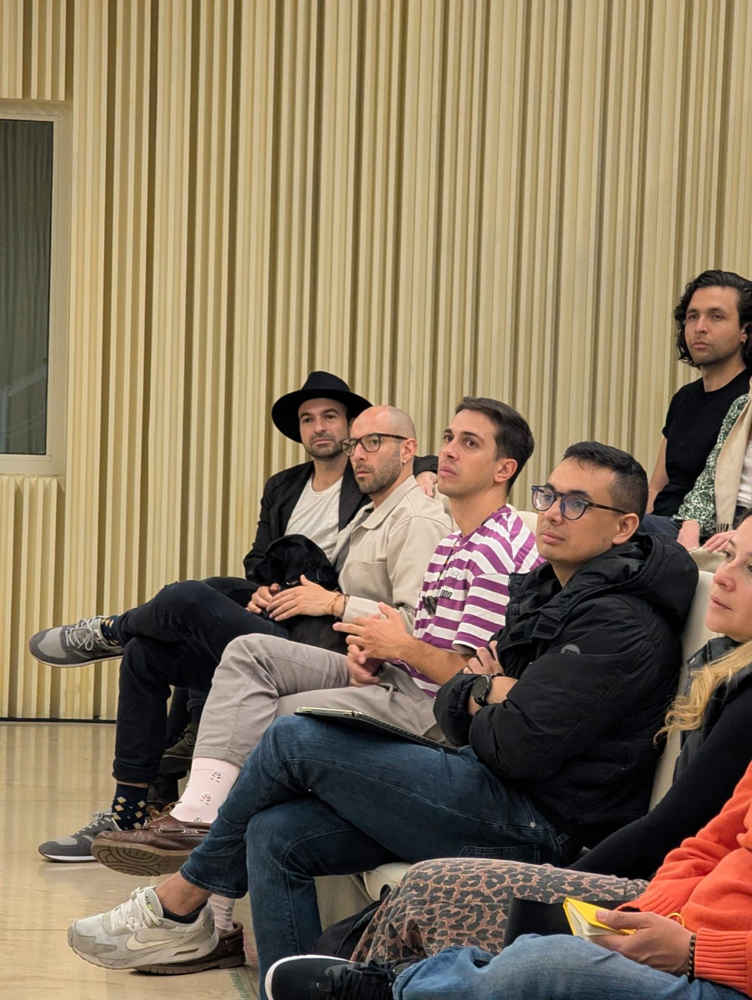
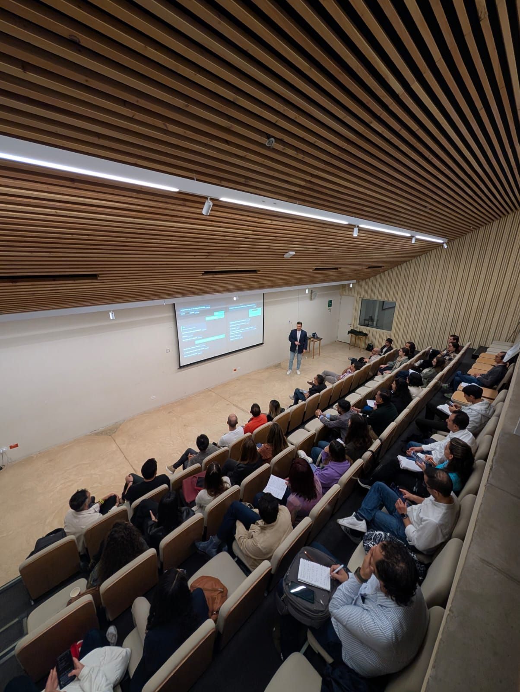

> *Originally posted on [LinkedIn](https://www.linkedin.com/posts/smuriel_aprend%C3%AD-a-mantener-el-fuego-prendido-activity-7405692602496417793-odya)*

I learned to keep the fire burning 🔥, to dodge the sales ninja bombs 🥷, and to let technology help me chase my purpose 🚀.

[Salua García Fakih](https://www.linkedin.com/in/saluagarcia), [Sandler Dan Macías](https://www.linkedin.com/company/sandlerdanmacias/), [Natalia Jiménez](https://www.linkedin.com/in/estaesnati) — THANK YOU for the generosity of sharing your knowledge and time with the community.

What a way to close Ignia's year — learning from senseis and sherpas who believe in teaching (and learning) through doing. And at the CEFE!!

And how awesome to see a living, breathing community. Every day, more people with an internal fire to BUILD and connect with like-minded people.

All ages, all backgrounds — from kids to seniors. But one thing was clear: above everything, DO IT ⚡

[Camilo Bonilla](https://www.linkedin.com/in/camilobonilla), just getting started.

PS — The best part. My kids watched me present. That feeling.

