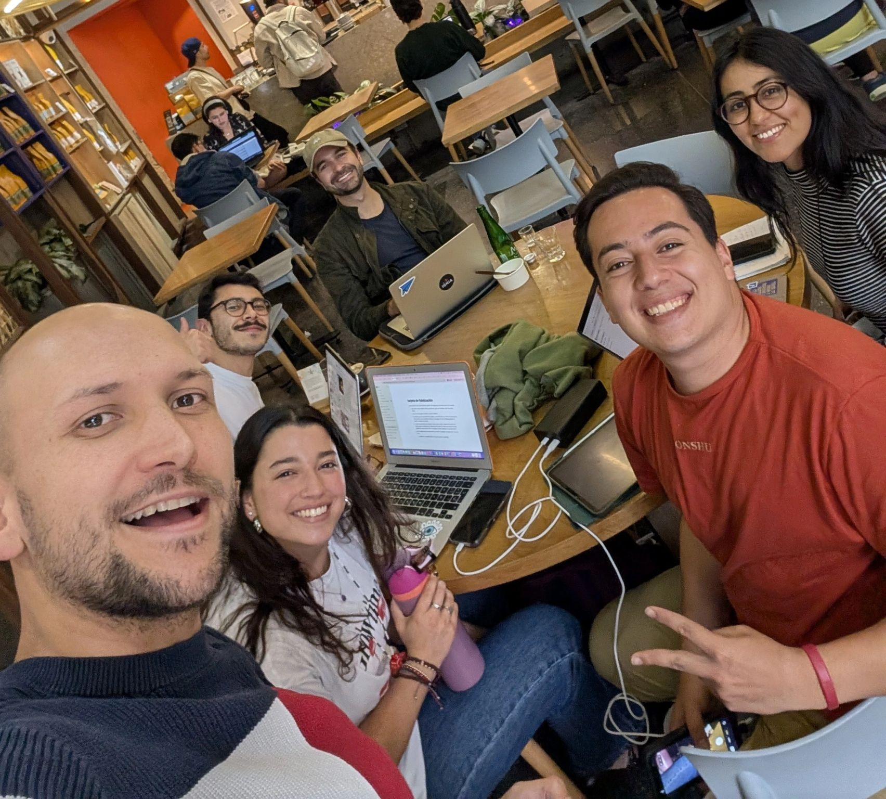

> *Originally posted on [LinkedIn](https://www.linkedin.com/posts/smuriel_nuestro-almuerzo-de-cierre-de-a%C3%B1o-ignia-activity-7407560076854505472-vyc9)*

Our Ignia year-end lunch 🔥 — what a joy to be building with you all [Camilo Bonilla](https://www.linkedin.com/in/camilobonilla) [Adriana Portilla Llaña](https://www.linkedin.com/in/adrianaportilla1) [Daniel Mayorga](https://www.linkedin.com/in/dannielmayorga)

And to close out the day, we caught up with 2 of our Action Lab 2.0 fellows [Sebastian Martinez Hoyos](https://www.linkedin.com/in/sebasmartinezhoyos) [Daniela A.](https://www.linkedin.com/in/danielaarenasg)

