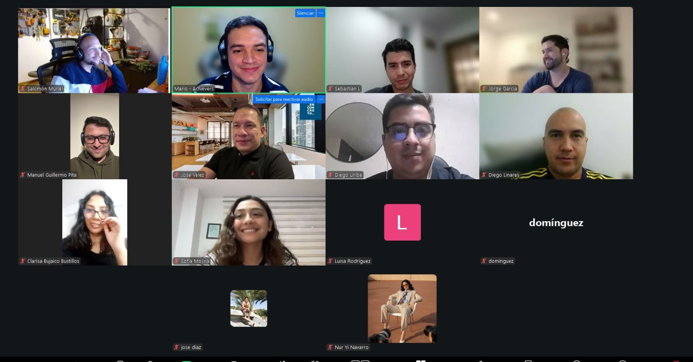

> *Originally posted on [LinkedIn](https://www.linkedin.com/posts/smuriel_un-honor-haber-podido-hablar-ayer-de-mi-historia-activity-7407766768884011008-7nAS)*

What an honor to have talked yesterday about my story of entrepreneurial screw-ups at [Achievers](https://www.linkedin.com/company/join-achievers/) — summary of my mistakes (and learnings) below 👇

It makes me really happy that from multiple fronts we're rethinking how education should work — making it more practical, direct, and modern 🔥

Summary of my mistakes/learnings after a decade of messing things up:

1. Healthy unit economics — and cash above everything else.
2. Aligned incentives among all parties — partners, investors, employees, clients.
3. Diversifying clients is a MUST.
4. Humility to listen to the market and fall out of love with your own ideas.
5. Hire fast and fire even faster.
6. Follow your purpose — not the money. The money follows.

Thank you [Rebeca Portilla Llaña](https://www.linkedin.com/in/rebecaportillallana) and [Mario  Bustillo ](https://www.linkedin.com/in/mario-bustillo) for the invitation!

