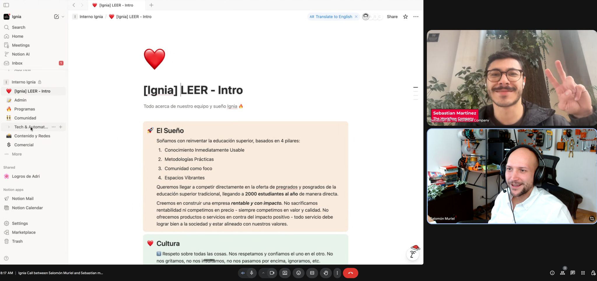

> *Originally posted on [LinkedIn](https://www.linkedin.com/posts/smuriel_qu%C3%A9-hacer-despu%C3%A9s-de-crear-un-producto-y-activity-7409241918653501440-Q5e7)*

What to do after building a product and getting traction? Our bet — build systems and processes.

In Ignia's first 6 months, we were able to test the product, start profitably (we've had salaries since month 3!), and hire an initial team.

Now — time to fix the chaos of laying train tracks while the train was already moving 🚆

❌ No sales system (sorry [Dan Macías](https://www.linkedin.com/in/sandlerdanmacias) [Carlos Echeverry](https://www.linkedin.com/in/carlos-echeverry), please don't hit me 🙈)

❌ No communication structure (random WhatsApp blasts everywhere)

❌ No file or data management (everything scattered across Drive, our phones, and laptops)

❌ No administrative order — rushing payments to vendors, charging clients whenever we remembered

**Our solution:**

1. Hire admin support. Someone dedicated to processing payments and chasing invoices.
2. Get off WhatsApp and onto a specialized platform (Mattermost — like Slack but Open Source).
3. Build a solid [Notion](https://www.linkedin.com/company/notionhq/) setup to track our chaos — no more scattered mess across a hundred places.
4. Build our Sales system on Notion, with steps and automations tailored to our business.

Choosing Notion was a journey. We needed something to organize all of the above with integrations, that wasn't expensive, and was flexible. We went through a lot of options.

Extra — we needed a simple CRM that multiple team members (including marketing) could use to track our sales process, without paying a fortune. HubSpot — $2,300/year 🫠 I looked at a hundred options and honestly didn't find what I needed.

Notion let us build it (quite easily actually — there's a CRM template that fit us perfectly).

[Sebastian Martinez Hoyos](https://www.linkedin.com/in/sebasmartinezhoyos) helped us — he's running Notion workshops for the team and helping set things up. Thanks to that we can now do some of the automations we've been wanting:

1. Community interaction tracking.
2. Pre-built newsletter with automatic metrics and monthly news.
3. Mini-CRM connected to our website for business processes.

I think one of the most important things after launching and running an MVP is having structure.

At Ignia we're using these low-meeting days to do exactly that — build better rails so we can spend next year focused on scaling and growing 🚀

What tools or strategies do you use to bring order to your company or work, so it doesn't descend into chaos?

