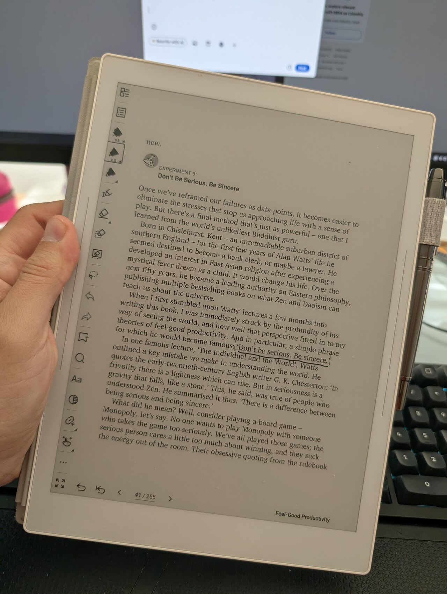

> *Originally posted on [LinkedIn](https://www.linkedin.com/posts/smuriel_a-qui%C3%A9n-no-le-da-mamera-jugar-monopolio-con-activity-7410334709584433153-dtOZ)*

Who doesn't hate playing Monopoly with the person who takes everything way too seriously and refuses to have fun with it 🫠

My first big lesson from Feel-Good Productivity by [Ali Abdaal](https://www.linkedin.com/in/ali-abdaal) — be less serious and more sincere — and you'll be happier in whatever you're doing.

Being sincere here means enjoying the activity for its own sake and obsessing less about the final result. "Playing" with sincerity instead of seriousness.

Thinking less about winning/losing and more about the journey.

If we stress less about the outcome and focus on doing each step well and enjoying the ride — we'll probably still get to the result we wanted, but we'll have been happier along the way.

And according to Abdaal, there are multiple studies showing that being happier makes us more creative and productive, which in turn makes us happier — a virtuous cycle of happiness 🤩

