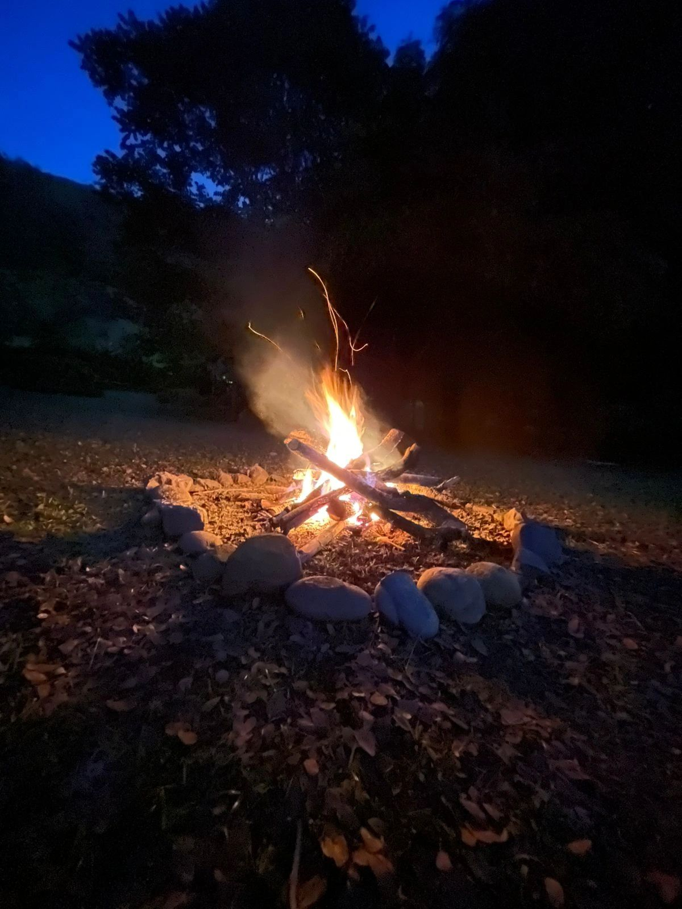

> *Originally posted on [LinkedIn](https://www.linkedin.com/posts/smuriel_todos-nacemos-con-una-fogata-pero-a-muchos-activity-7415754324691349504-bsjI)*

We're all born with a fire 🔥 but for many of us, it gradually goes out.

We're born with a blazing bonfire — kids naturally ask questions, try things, make things, explore — with an intense hunger for life.

Life slowly puts it out. Whether it's upbringing, school, trauma, circumstances — it's rare to make it to adulthood with the flame fully intact.

Mine got nearly extinguished by school and everything that happened there.

But it can be relit — you can add kindling and wood, and let it be reborn, grow again.

Play, Autonomy, and People — the 3 key ingredients.

**Play** — making life, work, creativity, or social connection fun rather than serious. You have to enjoy the ride.

**Autonomy** — being able to decide what you're going to do — or at least how you do things.

**People** — connecting with others (family, partner, friends, colleagues). Having company on the road 💜. Plus, fire is contagious.

My fire stayed out for over a decade, and it reignited slowly. It took years to feel truly "alive" again.

It sparked a bit in college, more when I started entrepreneuring, a lot more when I got married and became a dad — and connecting with a purpose has brought it to the highest it's ever been.

From a smoldering ember to an intense fire — and it can keep growing.

The truth is... no one's fire has been completely extinguished. It can always come back.

Last night I made a bonfire. Who's ready to light their own?

