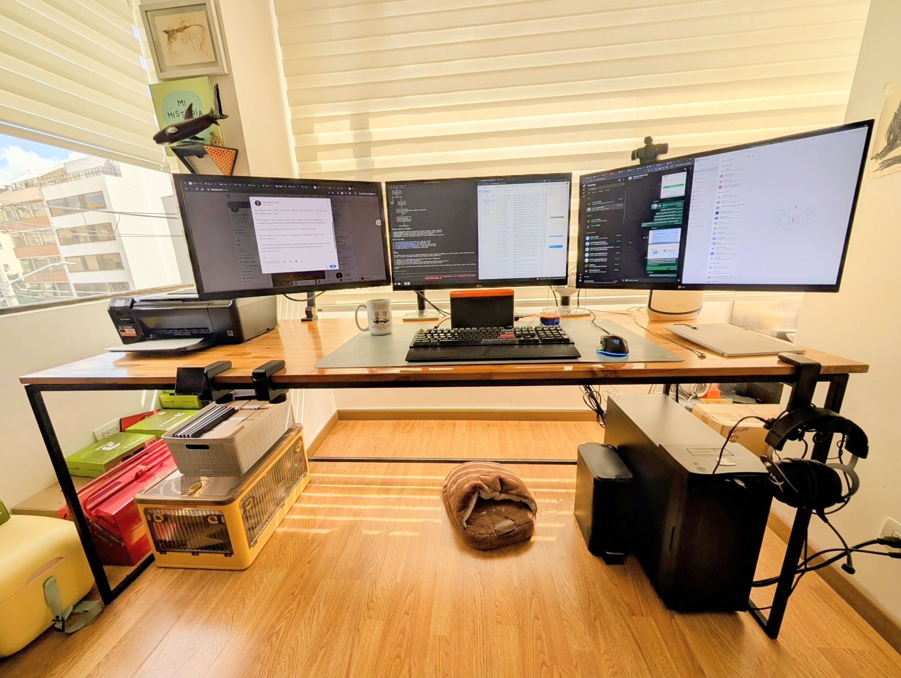
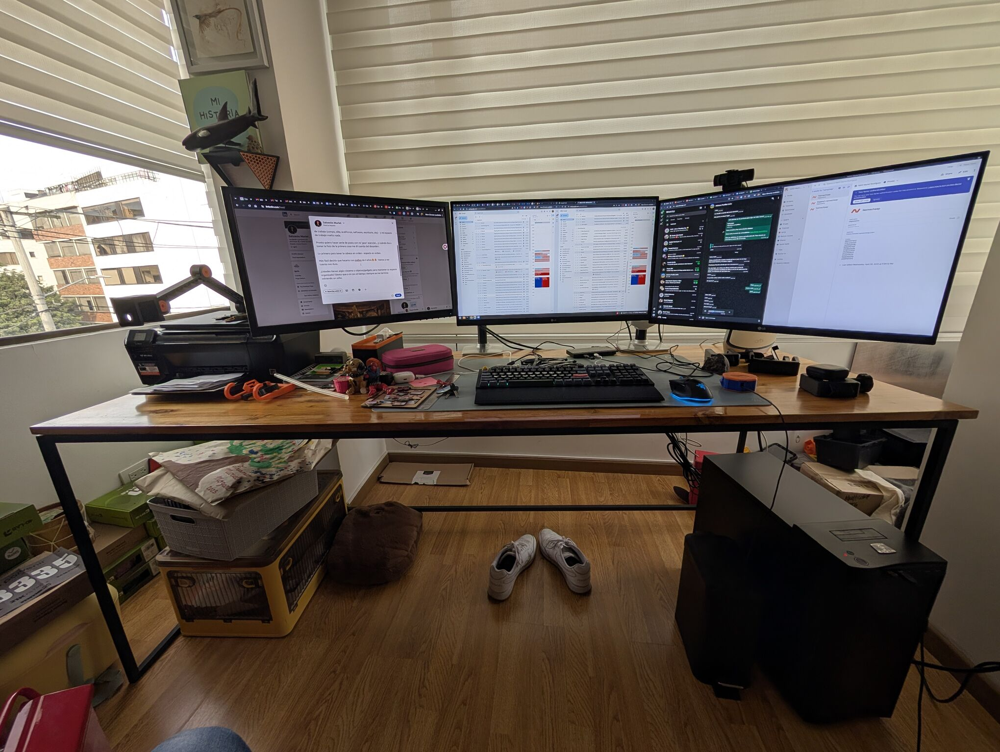

> *Originally posted on [LinkedIn](https://www.linkedin.com/posts/smuriel_confesi%C3%B3n-mi-escritorio-estaba-hecho-un-activity-7419405064911360000-WWJj)*

Confession — my desk was a total disaster — here's the before and after 🙈

I go around telling people they need to invest in their work tools (computer, chair, headphones, software, desk, etc.) — and my own workspace was a complete wreck.

I want to do a series of posts soon about my essential work gear... and when I was about to take the first photo I realized the mess.

Step one for a clear head: a clear space.

Easier said than done (especially with 4-year-old twins 🐥🐥). Let's see how long it lasts.

Do you have any systems, techniques, or gadgets for keeping your workspace organized? It feels like mine always ends up back in chaos over time.

