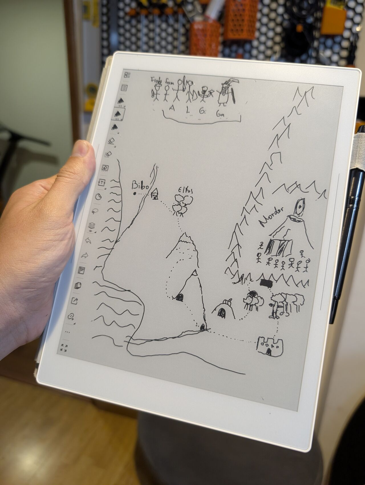
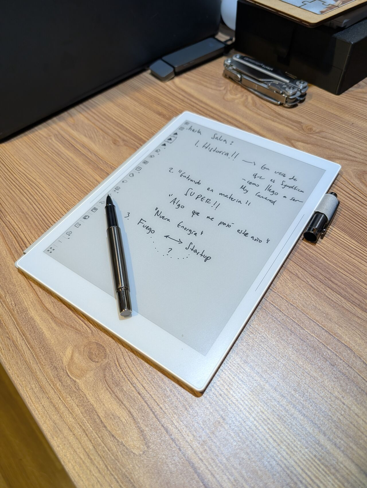
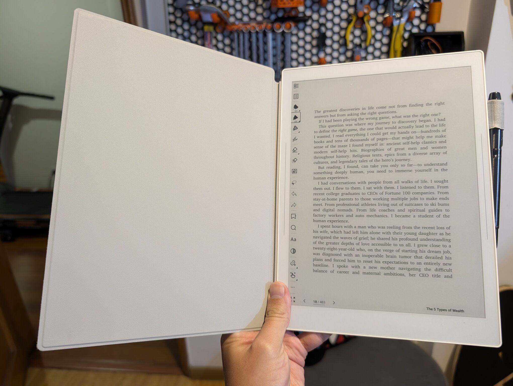
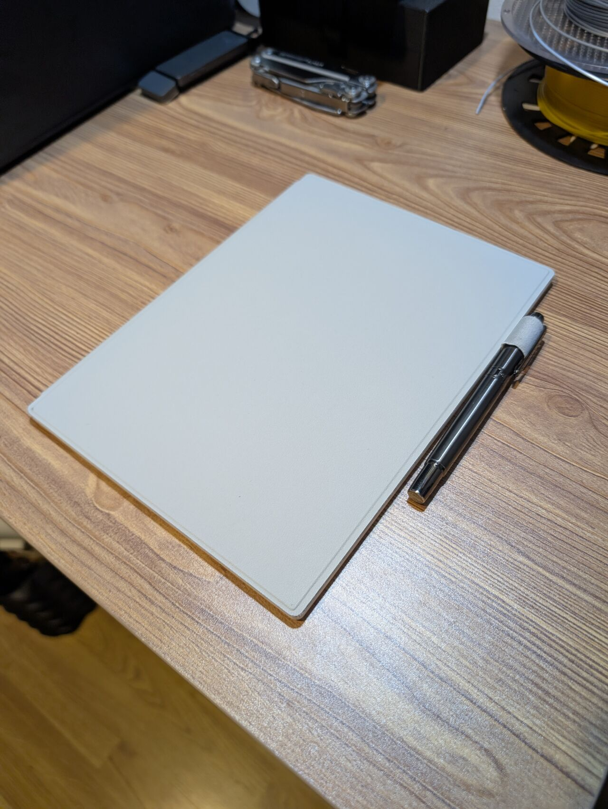

> *Originally posted on [LinkedIn](https://www.linkedin.com/posts/smuriel_mi-gadget-favorito-de-trabajo-mi-supernote-activity-7419725504800272385--oej)*

My favorite work gadget — my Supernote Manta ❤️ For writing, note-taking, and reading.

A little over a year ago I saw [Maribel Corrales](https://www.linkedin.com/in/maribelcorrales) with a tablet that was very different from an iPad — it was built for writing and reading, not apps and games.

That's when I discovered the world of E-Ink Tablets — designed for long battery life, note-taking, and reading (like a Kindle crossed with a notebook).

I was always carrying notebooks. I'd start one, lose it somewhere, move on to another, totally disorganized, never going back to re-read them. A notebook you'd never have to replace sounded perfect 🤩

I started looking right away. Turns out the Manta was about to launch. And bam, it showed up as a Christmas gift in 2024.

The battery lasts months. The writing feel is very, very close to writing with a ballpoint pen. Super intuitive for loose notes or using it as an e-reader.

Also — it looks great 💚 — which never hurts. I never leave without it — it comes to all my meetings. Highly recommend.

Bonus — excellent for keeping the kids busy. Here's my very Temu-edition map of Middle-Earth from when I explained Lord of the Rings to them 🧙‍♀️ (the story was also Temu edition — I forgot Pippin and Merry 😅)

