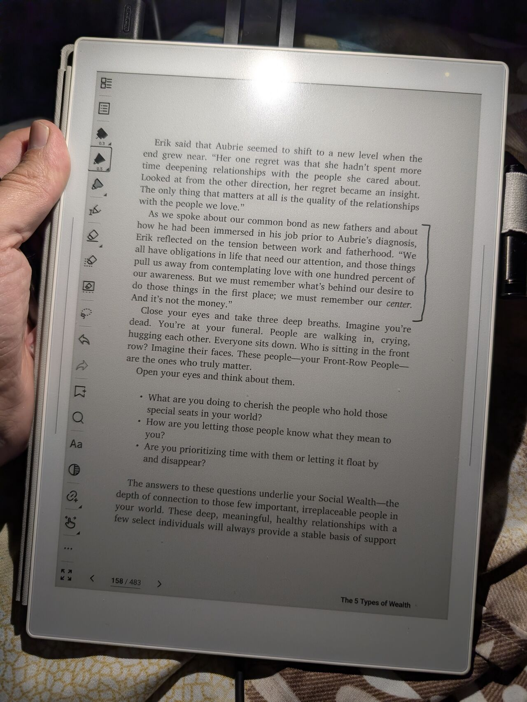

> *Originally posted on [LinkedIn](https://www.linkedin.com/posts/smuriel_la-tensi%C3%B3n-entre-el-trabajo-y-el-emprendimiento-activity-7424115596210089984-3Pwr)*

The tension between work (and entrepreneurship) and being a parent. And the guilt it brings. Long post.

The tension is real — you have to acknowledge it, accept it, and consciously decide where you stand on the scale.

A post by [Santiago Villadiego Mogollón](https://www.linkedin.com/in/santiagovilladiegomogollon) brought the topic back to mind after a couple of years.

When my kids were born, my productivity dropped to the floor (easily 5%) for ~3 months. And then, when I recovered some of that, it still felt incredibly low compared to before (around 60%).

Obviously, you'll say. Before I worked 14 hours a day and now "only" 8-10.

But it hurt — I felt guilty. For 2 reasons:

1️⃣ Feeling like I was a "shadow" of who I used to be.
2️⃣ Guilt from sometimes thinking I should spend less time with my kids to work more. And at the same time wanting to spend every possible moment with them. The tension itself made me feel guilty.

I managed to "make peace" mentally in three ways, thanks to coaching sessions with [Omar Salom](https://www.linkedin.com/in/omar-salom-108b9224):

▶️ Accepting that life time is limited, and the time with young kids even more so (~10 years or so!) — and that each day only has 24 hours.
▶️ Understanding that time with my kids is also productive — very productive. They are my most important project, by far.
▶️ Fully organizing my 8-10 daily work hours so that work productivity was as high as possible within that time.

Combined, I realized having kids didn't take productivity away from me — it multiplied it. Today I'm 95% productive at work and 300% productive overall compared to before.

Now, during my work hours, I produce in 8 hours what used to take me 14.

But more importantly — in my non-work time I'm engaged in the most powerful project possible: getting to know and co-building two good, capable, confident human beings who will together do 10 times what I could do in my entire life.

What could be more productive than that?

In the end, I chose entrepreneurship from the start so I could manage my own time and build a family.

Could my company do somewhat better if I spent less time with my kids? Probably. But would it be worth it? I don't think so.

I've found cool communities where people talk about this — [Eduardo Lloreda](https://www.linkedin.com/in/eduardo-lloreda), [Ignacio Salcedo](https://www.linkedin.com/in/isalcedo-dev), and [Sebastián Blanco](https://www.linkedin.com/in/sebastian-blanco-trujillo) lead some of them.

In 5 Types of Wealth, they make it very clear — what game are we playing? What are we working for? You have to remember the core, the center — and it's not money.

I think this should be talked about more. Which side of the scale are you on?

