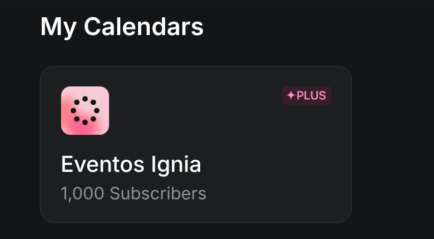

> *Originally posted on [LinkedIn](https://www.linkedin.com/posts/smuriel_vanity-metric-tal-vez-pero-qu%C3%A9-calientico-activity-7425653739862220800-kgpj)*

Vanity metric? Maybe. But it genuinely warms my heart to see that 1,000 people have signed up for Ignia community events (ALL in-person) ❤️

[Adriana Portilla Llaña](https://www.linkedin.com/in/adrianaportilla1) [Camilo Bonilla](https://www.linkedin.com/in/camilobonilla) [Daniel Mayorga](https://www.linkedin.com/in/dannielmayorga) — we're going for 10K. But this first thousand is already a huge milestone.

If you want to come to our next event, come through! They're all free and open to everyone. And to those already part of the community — thank you for bringing your fire 🔥

