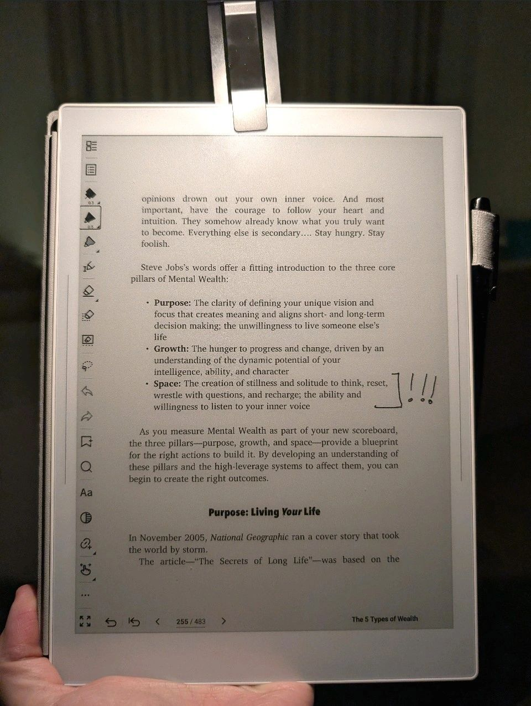

> *Originally posted on [LinkedIn](https://www.linkedin.com/posts/smuriel_nunca-he-tenido-tiempo-para-pensar-desde-activity-7426615693602615296-bpjV)*

I've never had "time to think."

Since I was a kid, I think I've been wrecking my dopamine systems. From one thing to the next to the next.

Video games (addiction-level, tens of thousands of hours). When I wasn't playing, I was sleeping, going to class, doing whatever mandatory activity came next, then back to playing.

And then I switched to more productive things — but I never gave myself any downtime.

Wake up, kids, work, kids and family, fixing things around the house, rushing to some appointment, sleep, repeat.

And I was proud of it. I even used "Don't plan, Do" as a mantra.

I thought I had balance — I spend a ton of time on "my personal life." But I never let myself think about "not doing."

Another gem from "5 Types of Wealth" — to have true mental wealth, we need quiet time. Time where we're not doing anything except listening to ourselves and thinking.

And I've never had it. Never! Insane, right?

It surprised me so much that I decided to do something about it immediately — I'm going to do a one-day retreat at a house in the countryside, just me with myself, no devices, no distractions.

What's going to go through my head when there's nothing to do but listen to my own thoughts?

