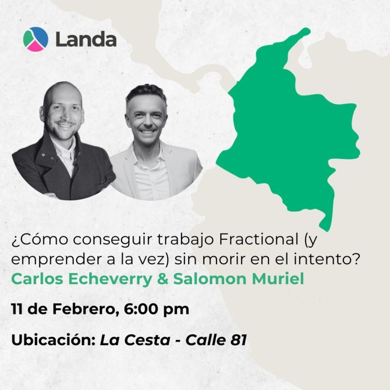

> *Originally posted on [LinkedIn](https://www.linkedin.com/posts/smuriel_conoc%C3%AD-a-landa-club-en-circunstancias-poco-activity-7427065499076706304-bhJ7)*

I met [Landa Club](https://www.linkedin.com/school/landaclub/) in unusual circumstances.

I was still at R5 — working full-time — but I was about to quit to go out on my own.

I didn't have time at R5 for consulting or being fractional, and I figured entrepreneurship would give me even less.

Then [Gabriel Tudela Aramburú](https://www.linkedin.com/in/gabrieltudela) reaches out with a pitch to get on the "learn to be a better consultant/fractional" train.

I didn't buy it — I was doing maybe 3 consulting gigs a year tops. But another part of what he told me hooked me hard: the community.

I was about to go out on my own — and he had a community of sharp people covering every area you'd need to build something big. I'd probably meet colleagues, peers, maybe even co-founders there.

Well, we were both right. I joined. I met the community — all of them sharp — and I ended up applying what I learned and becoming Fractional CTO for a couple of projects.

All while being a present dad to twins 💛
All while building my startup 🔥
All while training for my second half-marathon 👟 (okay, I've slipped on that one lately, haha)

That's how effective their method is.

This Wednesday, [Carlos Echeverry](https://www.linkedin.com/in/carlos-echeverry) (Landa's community lead in Colombia) invited me to talk about how to actually be Fractional for real, do more things, and survive the attempt.

Everyone's welcome! In-person in Bogotá, La Cesta de la 81 at 6PM.

Link to the Luma event in the comments.

