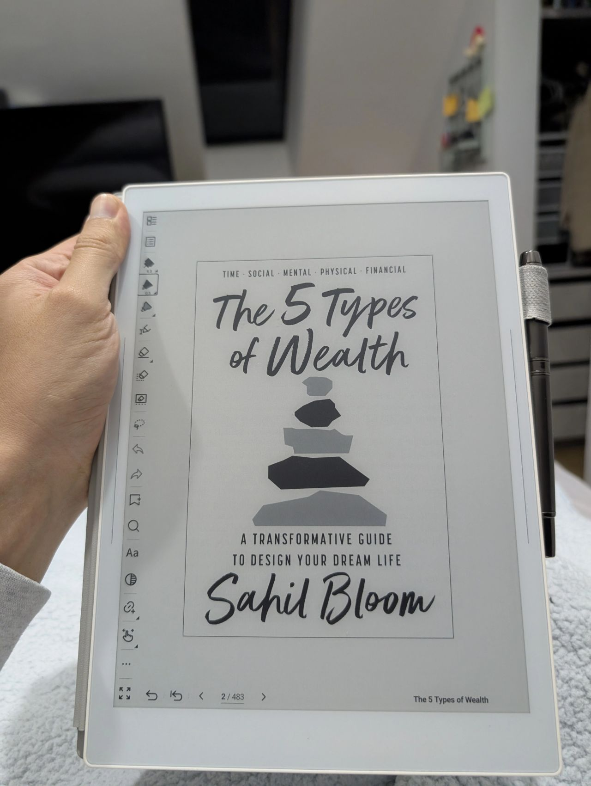
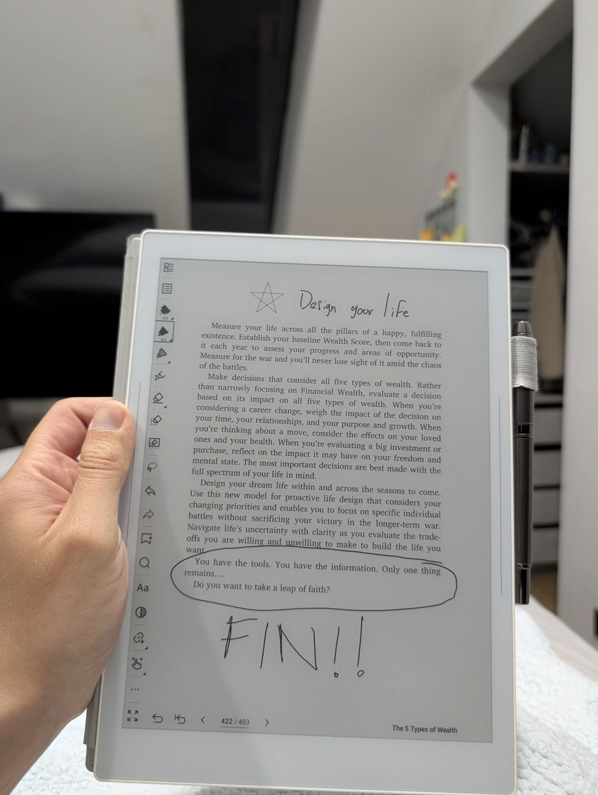

> *Originally posted on [LinkedIn](https://www.linkedin.com/posts/smuriel_acabo-de-terminar-5-tipos-de-riqueza-de-activity-7429147594926292992-fppz)*

I just finished "5 Types of Wealth" by [Sahil Bloom](https://www.linkedin.com/in/sahilbloom). I think it's my favorite book of all time ❤️ Mini-review:

I can't do anything but recommend it — practical and direct, but also deep, and it genuinely forces you to think.

It asks questions I'd never asked myself — and it made me answer them and take action.

Thanks to the book and its methods, in a little over a month I: got my YouTube addiction back under control, planned my social life more intentionally (with a massive focus on family), reaffirmed my purpose in education, rethought my finances (both my portfolio and my income/spending sources), meditated for the first time...

For the first time I actually "quantified" my wealth — in time, relationships, mental health, physical health, and finances.

It's incredible. Like Atomic Habits, but pointed directly at which habits and actions actually matter, with no ambiguity. And it forces you to rethink what's important and design your life on purpose.

If you're only going to read one book this year, make it this one.

Thank you [Miguel Vanegas Torres](https://www.linkedin.com/in/miguelvanegas) for the book club and for the luck of landing this gem in my second month in.

PS — I'm giving a copy away to someone, no strings attached, no need to repost or tag anyone. Just because more people need to read this. DM me in the comments, WhatsApp if you have it, or carrier pigeon (whatever works!) and I'll raffle it among everyone who reaches out today.

PS2 — 2 books in 2 months, after years of reading 1 or 2 per year. Next up: "Grit." Any other recommendations?

