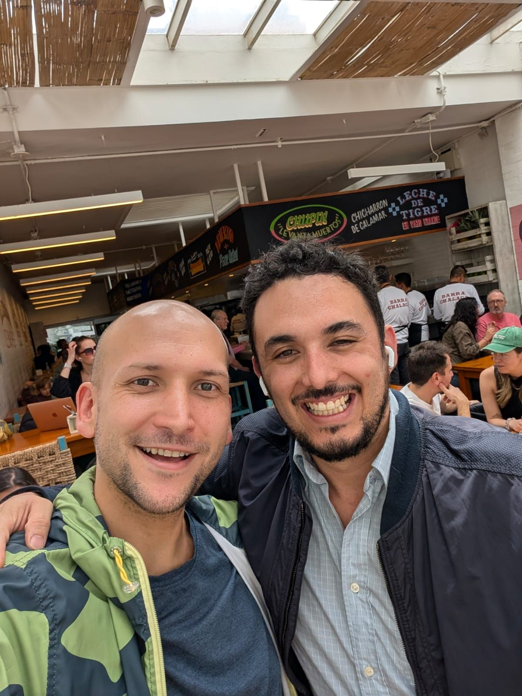

> *Originally posted on [LinkedIn](https://www.linkedin.com/posts/smuriel_conoc%C3%AD-a-andr%C3%A9s-m%C3%A9ndez-hace-12-a%C3%B1os-cu%C3%A1ndo-activity-7429509983421149184-JHqa)*

I met [Andrés Méndez](https://www.linkedin.com/in/andresfmendez) 12 years ago, when we were both just starting out as entrepreneurs.

We almost jumped on the same boat together but he already had his co-founders (and some experience). I had no idea what I was doing.

After a few failed ventures (and 11 years — now in 2025) we reconnected. He'd just been named President of [Colombia Edtech](https://www.linkedin.com/company/colombiaedtech1/), and I was just starting to build Ignia.

Turns out we've walked very similar paths — we each built, broke, and sold several companies. We found our strengths, our weaknesses (still working on those), and our purpose.

And now we have even more in common:
- A passion for education.
- Building through collaboration (not by destroying the competition, but by collaborating with it).
- Dreaming big.
- Building people — and therefore, a country.

It's been a full year since we reconnected. What a year it's been. We've been able to advise each other, talk through what each of us is building, and have real conversations about life and everything in between.

I think it's incredibly important to build long-term relationships with people you admire. Andrés is one of those people for me. He's probably the only person in Colombia who's simultaneously president of two industry associations. A real standout.

What an incredible year it's been, co-building and connecting with people I admire like him, [Henry May](https://www.linkedin.com/in/henry-may), [Santiago Amador](https://www.linkedin.com/in/santiago-amador-91b1733b), [Camilo Bonilla](https://www.linkedin.com/in/camilobonilla), [David Mauricio](https://www.linkedin.com/in/david-gonzalez-educacion-edtech-inteligencia-artificial), [Natalia Castro](https://www.linkedin.com/in/natalia-castro-montana), [Nicolás Varón](https://www.linkedin.com/in/nicolasvaronrodriguez), [Adriana Portilla Llaña](https://www.linkedin.com/in/adrianaportilla1), [Camilo Ramirez](https://www.linkedin.com/in/camilo-ramirez-29975a40), [Camilo Ramírez](https://www.linkedin.com/in/camiloramirez) (CR squared), [Luis Felipe Barrientos Moreno](https://www.linkedin.com/in/luis-felipe-barrientos-moreno), [Marcela Escovar Aparicio](https://www.linkedin.com/in/marcela-escovar), [Maria Fernanda Montejo](https://www.linkedin.com/in/mariafernandamontejo), and so many others — people who genuinely believe you can build a better country the right way, without trampling anyone, while still dreaming big and executing at the highest level.

Who else wants to join? Who else believes you can build through collaboration instead of fighting? Who else has the fire 🔥 burning bright for their projects and ideas?

