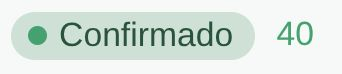

> *Originally posted on [LinkedIn](https://www.linkedin.com/posts/smuriel_ayer-llor%C3%A9-los-que-me-conocen-sabe-que-activity-7432106351604011008-ZtAb)*

Yesterday I cried 😭 (those who know me know this happens a lot...)

But from pure joy. It blows my mind that we filled our Action Lab (and I think we'll have enough demand for a pre-sale of the 3.0).

My wife explained the achievement to my kids, and they got so excited for me 🥹

With 1/10 of the budget, 1/10 of the brand recognition of other programs, but 100x the scrappiness and grit. Fully bootstrapped.

My eyes water just writing this. Incredible.

A win for many people:

It's thanks to all the Action Lab 1.0 fellows — who believed in this when it didn't exist yet — and the 2.0 fellows who are adding their fire 🔥.

To the 107 people from my research last year who gave so much shape and color to the idea.

To [Camilo Bonilla](https://www.linkedin.com/in/camilobonilla) for jumping on this after knowing me for one week.

To our incredible team: [Adriana Portilla Llaña](https://www.linkedin.com/in/adrianaportilla1), [Daniel Mayorga](https://www.linkedin.com/in/dannielmayorga), [Bianca Mendoza Quintana](https://www.linkedin.com/in/bianca-mendoza-quintana-81079a367), [Juan Jiménez](https://www.linkedin.com/in/juanesjmnz).

To the Ignia community that keeps growing every Thursday 🚀.

And to this incredible network that has only brought me learning, connections, and visibility for the dream we're building.

We keep reimagining higher education — one step at a time ⛰️

