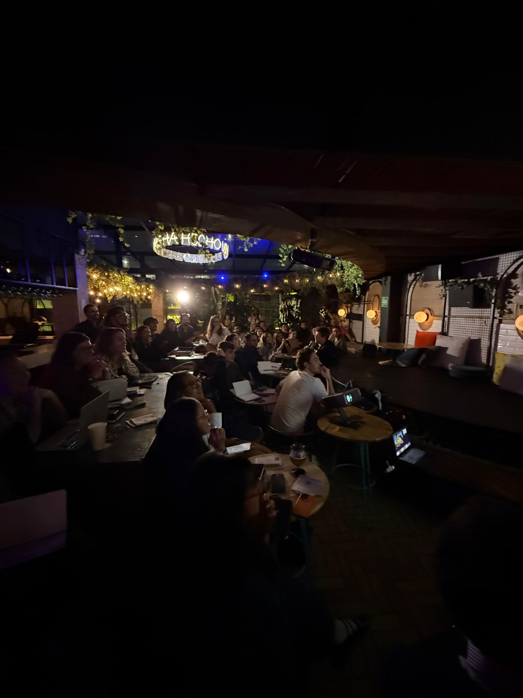

> *Originally posted on [LinkedIn](https://www.linkedin.com/posts/smuriel_si-alguien-le-pregunta-a-mis-hijos-c%C3%B3mo-activity-7432824210592505856-2pXw)*

If someone asks my kids "what's your dad like?"... they're not going to say "he's really good at tech and entrepreneurship." They're going to say "he's fun, he plays with me, he tells me stories... and he does something called Ignia."

We shouldn't define ourselves by what we do — but by who we are. And part of "who we are" is mindset. Are we optimistic? Do we believe we're capable?

Yesterday [Luis Felipe Barrientos Moreno](https://www.linkedin.com/in/luis-felipe-barrientos-moreno) gave us a masterclass on Mindset.

Achieving things is possible with the right mindset. The main limit isn't time, the body, or resources — it's believing in yourself.

And when you have the mindset — things happen, and people notice the change in you. They help you, they push you forward. Mindset is the engine.

We need more people who think about themselves from multiple angles — and who actually believe in what they're going for. YES YOU CAN — whatever you have in mind.

"Shoot for the moon, even if you miss, you'll land among the stars"

