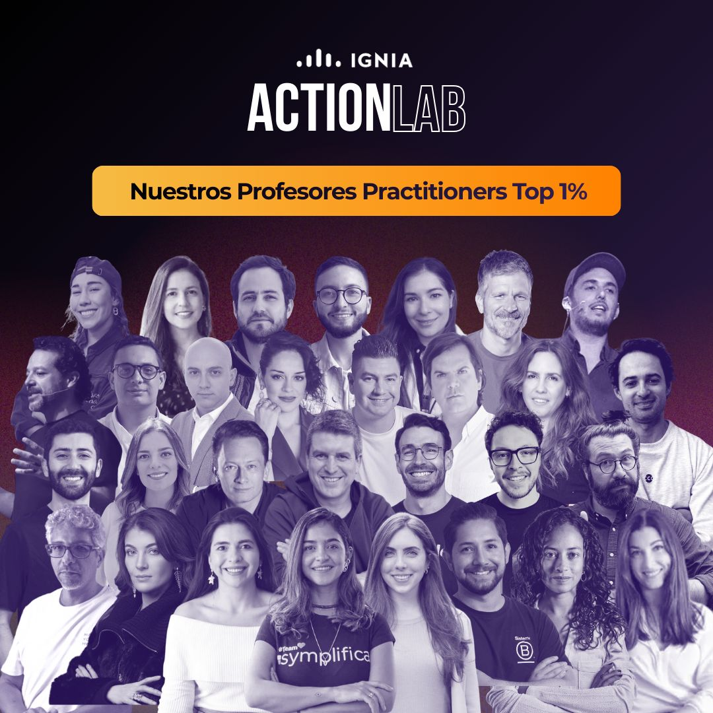

> *Originally posted on [LinkedIn](https://www.linkedin.com/posts/smuriel_co-construir-en-hombros-de-gigantes-activity-7434260018247610370-AVw_)*

(Co)-Building on the shoulders of giants 🚀

One of the most important values in Ignia's culture is building together — collaborating over competing. We believe that "let's build this together" creates far more value than the zero-sum game of cutthroat competition.

On this Monday of gratitude, I want to thank the incredible teachers of our Action Lab — without whom the Action Lab (and Ignia itself!) wouldn't exist, and who have contributed so much in ideas and energy to this dream of reimagining higher education.

One of the greatest pleasures of building this is being able to sit down and talk with so many interesting, passionate people and understand the world from many different perspectives — all rowing toward building the same thing.

Tagging everyone in the photo (and [Laura Sánchez M.](https://www.linkedin.com/in/laura-sanchez-m) here who somehow escaped the photo, not sure why). Infinite thanks for adding your fire to this mission 🔥

